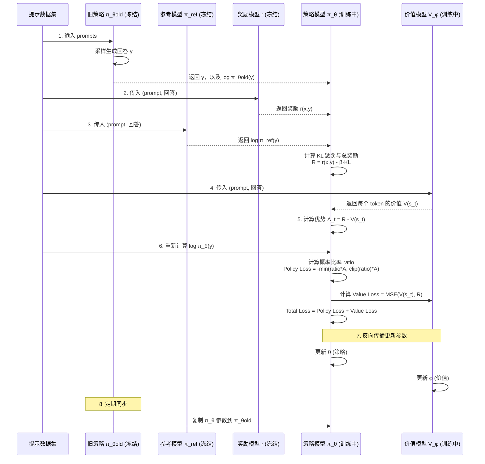
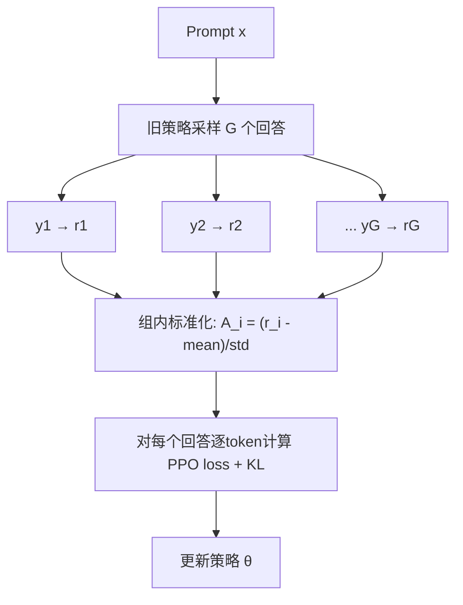

<figure class="source-cover">
  
  <figcaption>Imagen 生成配图，基于本文主题绘制。</figcaption>
</figure>

# 总体对比

|方法|核心思想|是否需要奖励模型|是否需要 Critic|训练稳定性|在线/离线|典型应用|
|---|---|---|---|---|---|---|
|**RLHF**|框架：先训RM，再用PPO优化|✅ 必须|✅ 必须|低，调参困难|在线|ChatGPT|
|**PPO**|带剪切目标的策略梯度，RLHF中的优化器|✅|✅|中（需技巧）|在线|RLHF 骨干|
|**DPO**|直接优化偏好对数概率|❌ 不需要|❌ 不需要|高，类似分类|离线|Llama 2/3 对齐|
|**GRPO**|组内相对优势，丢弃Critic|✅ 需要（或规则）|❌ 不需要|中高，避免价值拟合|在线|DeepSeek-R1 数学推理|

# 1. RLHF 与 PPO 的深层原理

### 1.1 RLHF 的数学本质：带 KL 约束的奖励最大化

RLHF 要解决如下优化问题：

$$
\max_{\pi_\theta}
\mathbb{E}_{x\sim\mathcal D,\;y\sim\pi_\theta(\cdot\mid x)}
\left[r(x,y)\right]
-
\beta\,
\mathbb{E}_{x\sim\mathcal D}
\left[
\operatorname{KL}
\left(
\pi_\theta(\cdot\mid x)
\middle\|
\pi_{\mathrm{ref}}(\cdot\mid x)
\right)
\right].
$$

- 第一项鼓励高奖励，第二项惩罚策略偏离 SFT 模型 $\pi_{\mathrm{ref}}$，防止语言模型退化。

- $\beta$ 越小，允许的偏离越大。
    

**关键结论**（可推导）：该优化问题在**无参数化约束**下的最优策略具有解析形式：

$$
\pi^*(y\mid x)
=
\frac{1}{Z(x)}
\pi_{\mathrm{ref}}(y\mid x)
\exp\left(\frac{1}{\beta}r(x,y)\right).
$$

其中 $Z(x)$ 是配分函数（归一化因子）。
这个结论是 **DPO 能够绕过奖励模型的理论基础**。

### 1.2 PPO：如何以“近端”方式逼近该最优策略

PPO 在 RLHF 中的工作流程如下：

```text
状态  $s_t = (x, y_{<t})$        # 当前已生成的文本前缀
动作 $a_t = y_t$                  # 下一个 token
奖励 $R$   = 仅在序列结束时提供整个序列的奖励模型评分
```

PPO 需要不断采样新数据（在线），因此必须维护四个模型：

- **Policy Model** $\pi_\theta$：正在优化的策略
    
- **Old Policy** $\pi_{\theta_{\mathrm{old}}}$：采样用的冻结策略
    
- **Reference Model** $\pi_{\mathrm{ref}}$：SFT 模型，用于计算 KL 惩罚
    
- **Critic (Value Model)** $V_\phi$：估计状态价值，用于计算优势
    

#### 图示：PPO 强化学习循环（RLHF 视角）




```python
import torch
import torch.nn.functional as F

def ppo_step(policy, old_policy, ref_model, reward_model, 
             value_model, prompts, tokenizer, beta=0.1, clip_eps=0.2):
    """
    policy: 当前策略 π_θ
    old_policy: 采样时的旧策略 π_θold (冻结)
    ref_model: 参考模型 π_ref (冻结)
    value_model: 价值网络 V_φ
    prompts: 一批输入 prompt
    """
    # --- 1. 采样回复并获取各项 log-prob ---
    with torch.no_grad():
        responses, old_logprobs = old_policy.sample(prompts)  # shape: [B, L]
        ref_logprobs = ref_model.log_prob(prompts, responses)
    
    # --- 2. 计算奖励与 KL 惩罚得到总奖励 ---
    rewards = reward_model(prompts, responses)  # [B]
    kl = old_logprobs.sum(-1) - ref_logprobs.sum(-1)  # 序列级 KL
    total_rewards = rewards - beta * kl               # 总奖励 R_total
    
    # --- 3. 用 Critic 估计价值并计算优势函数 (此处简化为 GAE 的 Monte Carlo 形式) ---
    values = value_model(prompts, responses)          # 每个 token 的状态价值
    # 优势: 用总奖励作为“回报”, 减去 baseline (为了稳定)
    # 实际 RLHF 中常将序列奖励复制到每个 token
    advantages = total_rewards.unsqueeze(-1) - values.detach()
    # 标准化优势（可选）
    advantages = (advantages - advantages.mean()) / (advantages.std() + 1e-8)
    
    # --- 4. 计算新策略 log-prob ---
    new_logprobs = policy.log_prob(prompts, responses)  # [B, L]
    
    # --- 5. PPO Clipped 目标 ---
    ratio = torch.exp(new_logprobs - old_logprobs)      # π_θ / π_θold
    surr1 = ratio * advantages
    surr2 = torch.clamp(ratio, 1-clip_eps, 1+clip_eps) * advantages
    policy_loss = -torch.min(surr1, surr2).mean()
    
    # --- 6. Critic 损失 (价值函数逼近总奖励) ---
    value_loss = F.mse_loss(values, total_rewards.unsqueeze(-1).expand_as(values))
    
    # 合并损失并反向传播
    loss = policy_loss + value_loss
    return loss
```

# 2. DPO

由最优策略反解隐式奖励：

$$
r(x,y)
=
\beta\log\frac{\pi^*(y\mid x)}{\pi_{\mathrm{ref}}(y\mid x)}
+\beta\log Z(x).
$$

Bradley-Terry 偏好模型给出胜者 $y_w$ 优于败者 $y_l$ 的概率：

$$
p(y_w\succ y_l\mid x)
=
\sigma\left(r(x,y_w)-r(x,y_l)\right).
$$

代入隐式奖励后，$\log Z(x)$ 在差值中抵消：

$$
p(y_w\succ y_l\mid x)
=
\sigma\left[
\beta\log\frac{\pi^*(y_w\mid x)}{\pi_{\mathrm{ref}}(y_w\mid x)}
-
\beta\log\frac{\pi^*(y_l\mid x)}{\pi_{\mathrm{ref}}(y_l\mid x)}
\right].
$$

因此 DPO 直接最小化：

$$
\mathcal L_{\mathrm{DPO}}
=
-
\mathbb E_{(x,y_w,y_l)}
\left[
\log\sigma\left(
\beta\log\frac{\pi_\theta(y_w\mid x)}{\pi_{\mathrm{ref}}(y_w\mid x)}
-
\beta\log\frac{\pi_\theta(y_l\mid x)}{\pi_{\mathrm{ref}}(y_l\mid x)}
\right)
\right].
$$


```python
def dpo_loss(pi_logps_w, pi_logps_l, ref_logps_w, ref_logps_l, beta=0.1):
    """
    pi_logps_w: 当前策略对胜出回答的 log-prob 总和 (B,)
    pi_logps_l: 当前策略对失败回答的 log-prob 总和 (B,)
    ref_logps_w: 参考策略对胜出回答的 log-prob 总和 (B,)
    ref_logps_l: 参考策略对失败回答的 log-prob 总和 (B,)
    """
    # 隐式奖励差异
    pi_ratio_w = pi_logps_w - ref_logps_w
    pi_ratio_l = pi_logps_l - ref_logps_l
    logits = beta * (pi_ratio_w - pi_ratio_l)  # 胜者-败者的隐式奖励差
    
    loss = -F.logsigmoid(logits).mean()
    # 可选：加入 SFT 正则 loss = -log π_θ(y_w|x)，增强稳定性
    return loss

# 训练示例
for batch in dataloader:
    x, y_w, y_l = batch
    # 获取 log-prob
    pi_logps_w = policy.log_prob(x, y_w).sum(-1)
    pi_logps_l = policy.log_prob(x, y_l).sum(-1)
    with torch.no_grad():
        ref_logps_w = ref_model.log_prob(x, y_w).sum(-1)
        ref_logps_l = ref_model.log_prob(x, y_l).sum(-1)
    
    loss = dpo_loss(pi_logps_w, pi_logps_l, ref_logps_w, ref_logps_l, beta=0.1)
    optimizer.zero_grad(); loss.backward(); optimizer.step()
```


# 3. GRPO：无价值网络的组内相对优势

对于同一个 prompt $x$，采样 $G$ 个回答 $y_1,\ldots,y_G$，得到奖励 $r_1,\ldots,r_G$。组内标准化优势为：

$$
A_i
=
\frac{r_i-\operatorname{mean}(r_1,\ldots,r_G)}
{\operatorname{std}(r_1,\ldots,r_G)}.
$$

GRPO 保留 PPO 的序列级剪切目标：

$$
\mathcal J_{\mathrm{GRPO}}(\theta)
=
\frac{1}{G}
\sum_{i=1}^{G}
\frac{1}{|y_i|}
\sum_{t=1}^{|y_i|}
\min\left(
\rho_{i,t}A_i,\,
\operatorname{clip}(\rho_{i,t},1-\epsilon,1+\epsilon)A_i
\right),
$$

其中

$$
\rho_{i,t}
=
\frac{\pi_\theta(y_{i,t}\mid x,y_{i,<t})}
{\pi_{\theta_{\mathrm{old}}}(y_{i,t}\mid x,y_{i,<t})}.
$$

常用的无偏 KL 估计器为：

$$
D_{\mathrm{KL}}
=
\frac{1}{|y|}
\sum_t
\left(
\frac{\pi_{\mathrm{ref}}(y_t)}{\pi_\theta(y_t)}
-
\log\frac{\pi_{\mathrm{ref}}(y_t)}{\pi_\theta(y_t)}
-1
\right).
$$

最终最大化带 KL 惩罚的目标：

$$
\mathcal J_{\mathrm{GRPO}}(\theta)-\beta D_{\mathrm{KL}}.
$$




```python
def grpo_update(policy, old_policy, ref_model, reward_func, 
                prompts, beta=0.04, clip_eps=0.2, G=4):
    """
    reward_func: 接受 (prompts, responses) 返回分数张量 [B*G]
    """
    # 1. 用 old_policy 为每个 prompt 生成 G 个回答
    responses, old_logps_list = [], []
    for _ in range(G):
        resp, old_lp = old_policy.sample(prompts)  # old_lp: [B, L]
        responses.append(resp)
        old_logps_list.append(old_lp)
    
    # 将所有回答合并, [B*G, L]
    all_responses = torch.cat(responses, dim=0)
    all_old_logps = torch.cat(old_logps_list, dim=0)
    
    # 2. 计算每个回答的奖励
    rewards = reward_func(prompts.repeat_interleave(G, dim=0), all_responses)  # [B*G]
    
    # 3. 组内归一化得到优势
    rewards = rewards.view(-1, G)  # [B, G]
    mean_r = rewards.mean(dim=1, keepdim=True)
    std_r  = rewards.std(dim=1, keepdim=True) + 1e-8
    advantages = (rewards - mean_r) / std_r
    advantages = advantages.view(-1)  # 展平回 [B*G]
    
    # 4. 计算当前策略 log-prob 和参考策略 log-prob
    new_logps = policy.log_prob(prompts.repeat_interleave(G, dim=0), all_responses)
    with torch.no_grad():
        ref_logps = ref_model.log_prob(prompts.repeat_interleave(G, dim=0), all_responses)
    
    # 5. 策略损失 (PPO-clip，优势扩大到 token 维度)
    ratio = torch.exp(new_logps - all_old_logps)      # [B*G, L]
    adv_expanded = advantages.unsqueeze(-1).expand_as(ratio)
    surr1 = ratio * adv_expanded
    surr2 = torch.clamp(ratio, 1-clip_eps, 1+clip_eps) * adv_expanded
    policy_loss = -torch.min(surr1, surr2).mean()
    
    # 6. KL 惩罚 (k3 estimator)
    # 注意公式: (p_ref/p_θ) - log(p_ref/p_θ) - 1
    ref_div_pi = torch.exp(ref_logps - new_logps)  # π_ref/π_θ
    kl_per_token = ref_div_pi - (ref_logps - new_logps) - 1
    kl_loss = kl_per_token.mean()
    
    total_loss = policy_loss + beta * kl_loss
    return total_loss
```


# Q1: 每次训练，都得是完整rollout出整个seq之后，再后验计算分配到每个token上计算loss是么

<figure class="qa-figure">
  
  <figcaption>PPO/GRPO Q1: 完整 rollout 后再计算 token loss</figcaption>
</figure>

**是的，你的理解完全正确。**

在 RLHF 的 PPO（以及 GRPO）训练中，每一次参数更新前，确实都必须**先完整生成整个回答（rollout），然后再回过头为每一个 token 计算损失并分配梯度**。这是由“奖励模型的评分只能在序列结束后获得”这一根本性质决定的。

---

## 1. 为什么必须“完整 rollout 后再分配”？

因为**所有 token 的损失计算，都依赖于最终序列的奖励和 KL 惩罚总和**。

- **奖励模型**只看完整回答，中间状态没有分数。
    
- **KL 惩罚**虽然可以逐 token 算出，但总 KL 在序列未结束时也是未知的。
    
- 优势函数 $A_t$ 依赖于总回报 $R_t$，而 $R_t$ 需要从序列末尾反向累积。
    

因此，在生成过程中，无法及时为每个 token 提供准确的梯度信号。训练流程必然是：

1. **采样阶段（Rollout）**：用旧策略完整生成回答。
    
2. **评分阶段**：序列完成后，用奖励模型评出最终分数，加上每步 KL 惩罚合成总回报。
    
3. **回溯阶段**：从最后一个 token 开始，反向计算每一步的回报 $R_t$ 和优势 $A_t$。
    
4. **更新阶段**：基于这些“后验”优势，计算 token 级别的 policy loss 和 value loss，并更新参数。
    

---

## 2. 这和“在线强化学习”矛盾吗？

不矛盾。这里的“在线”指的是**使用当前或近期的策略生成新数据**，但并不意味着必须逐 token 即时更新。

典型的在线 PPO（如 RLHF）循环：


```text

for iteration in range(N):
    # 1. 使用旧策略 rollout 一批完整回答（在线采样）
    responses = old_policy.generate(prompts)  # 完整序列
    
    # 2. 后验计算每个 token 的回报和优势（基于完整序列的奖励）
    rewards = reward_model(prompts, responses)  # 序列级
    kl_per_token = compute_kl(...)               # token级
    returns = compute_returns(rewards, kl_per_token)  # 从后往前累积
    advantages = returns - values  # 或 GAE
    
    # 3. 用这批（完整序列，已标注回报）的数据更新模型
    loss = ppo_loss(responses, old_logprobs, advantages)
    loss.backward()
    optimizer.step()
```

整个过程是“先生成完整数据，再一次性更新”，而不是每生成一个词就更新参数。

---

## 3. GRPO 也是如此？

是的。GRPO 也需要对每个 prompt 一次采样 $G$ 个完整回答，得到终局奖励后，再做组内标准化得到序列级优势 $A_i$，再让这个回答的所有 token 共享该优势。
它同样是**完整 rollout 后回溯**，只是优势更粗糙（序列级共享），计算更简单。

---

## 4. 有没有“逐 token 即时更新”的 RLHF？

理论上存在，但极其少见且不稳定。例如可以训练一个**过程奖励模型（PRM）**给中间步骤打分，或者用 Critic 的即时预测作为回报信号（但这需要 Critic 已经训练得很准确，自身又依赖于完整 rollout 的数据）。  
目前主流 RLHF（ChatGPT、DeepSeek-R1 等）全部采用**完整 rollout 后回溯**的方式。

**一句话总结：每次训练，都是等模型把整个回答“说”完，再回过头来复盘每个词的功过。**Q1: 每次训练，都得是完整rollout出整个seq之后，再后验计算分配到每个token上计算loss是么

Answer:**是的**

在 RLHF 的 PPO（以及 GRPO）训练中，每一次参数更新前，确实都必须**先完整生成整个回答（rollout），然后再回过头为每一个 token 计算损失并分配梯度**。这是由“奖励模型的评分只能在序列结束后获得”这一根本性质决定的。

---

## 1. 为什么必须“完整 rollout 后再分配”？

因为**所有 token 的损失计算，都依赖于最终序列的奖励和 KL 惩罚总和**。

- **奖励模型**只看完整回答，中间状态没有分数。
    
- **KL 惩罚**虽然可以逐 token 算出，但总 KL 在序列未结束时也是未知的。
    
- 优势函数 $A_t$ 依赖于总回报 $R_t$，而 $R_t$ 需要从序列末尾反向累积。
    

因此，在生成过程中，无法及时为每个 token 提供准确的梯度信号。训练流程必然是：

1. **采样阶段（Rollout）**：用旧策略完整生成回答。
    
2. **评分阶段**：序列完成后，用奖励模型评出最终分数，加上每步 KL 惩罚合成总回报。
    
3. **回溯阶段**：从最后一个 token 开始，反向计算每一步的回报 $R_t$ 和优势 $A_t$。
    
4. **更新阶段**：基于这些“后验”优势，计算 token 级别的 policy loss 和 value loss，并更新参数。
    

---

## 2. 这和“在线强化学习”矛盾吗？

不矛盾。这里的“在线”指的是**使用当前或近期的策略生成新数据**，但并不意味着必须逐 token 即时更新。

典型的在线 PPO（如 RLHF）循环：

```python
for iteration in range(N):
    # 1. 使用旧策略 rollout 一批完整回答（在线采样）
    responses = old_policy.generate(prompts)  # 完整序列
    
    # 2. 后验计算每个 token 的回报和优势（基于完整序列的奖励）
    rewards = reward_model(prompts, responses)  # 序列级
    kl_per_token = compute_kl(...)               # token级
    returns = compute_returns(rewards, kl_per_token)  # 从后往前累积
    advantages = returns - values  # 或 GAE
    
    # 3. 用这批（完整序列，已标注回报）的数据更新模型
    loss = ppo_loss(responses, old_logprobs, advantages)
    loss.backward()
    optimizer.step()
```

整个过程是“先生成完整数据，再一次性更新”，而不是每生成一个词就更新参数。

---

## 3. GRPO 也是如此？

是的。GRPO 也需要对每个 prompt 一次采样 $G$ 个完整回答，得到终局奖励后，再做组内标准化得到序列级优势 $A_i$，再让这个回答的所有 token 共享该优势。
它同样是**完整 rollout 后回溯**，只是优势更粗糙（序列级共享），计算更简单。

---

## 4. 有没有“逐 token 即时更新”的 RLHF？

理论上存在，但极其少见且不稳定。例如可以训练一个**过程奖励模型（PRM）**给中间步骤打分，或者用 Critic 的即时预测作为回报信号（但这需要 Critic 已经训练得很准确，自身又依赖于完整 rollout 的数据）。  
目前主流 RLHF（ChatGPT、DeepSeek-R1 等）全部采用**完整 rollout 后回溯**的方式。

**一句话总结：每次训练，都是等模型把整个回答“说”完，再回过头来复盘每个词的功过。**


# Q2:reward model和value model的关系

<figure class="qa-figure">
  
  <figcaption>PPO Q2: reward model 和 value model 的关系</figcaption>
</figure>


Reward Model 和 Value Model 是 RLHF + PPO 体系中**两个最容易混淆的模型**。它们都输出标量，但**时间粒度、预测目标、是否冻结**都完全不同。

---

## 1. 核心区别：一个给“最终评分”，一个估“未来总账”

| 对比维度           | **Reward Model（奖励模型）** | **Value Model / Critic（价值模型）**           |
| -------------- | ---------------------- | ---------------------------------------- |
| **评估对象**       | **完整回答** $y$             | **生成过程中的状态** $s_t$（前 $t$ 个 token）            |
| **输出含义**       | 整个回答的质量（是否符合人类偏好）      | 从状态 $s_t$ 开始，未来能获得的**预期总回报**               |
| **粒度**         | **序列级**（一个回答一个分数）      | **Token 级**（每个 token 位置都输出一个值）           |
| **训练阶段**       | RLHF 第 2 步，**独立训练并冻结** | PPO 阶段**在线训练，不断更新**                      |
| **训练信号**       | 人类偏好对（胜者 vs 败者）        | 实际产生的总奖励 $R_{\mathrm{total}}$（含奖励模型给出的分和 KL 惩罚） |
| **是否参与优势计算**   | 不直接参与，只是提供 $r(x,y)$      | **直接参与**，作为基线来算优势：$A_t=R_t-V(s_t)$         |
| **GRPO 中是否存在** | ✅ 存在（或退化为规则奖励）         | ❌ 完全不存在，被组内平均取代                          |

---

## 2. 它们是如何协作的？（PPO 视角）

在 RLHF 的 PPO 阶段，这两个模型各司其职：

- **Reward Model**：像一个裁判，在**序列生成完成后**，根据整个回答给出一个终极的偏好分数 r(x,y)。  
    这个分数是整个优化目标的基础，但它的缺点有两个：
    
    - 非常稀疏（只有一个数，没有中间反馈）
        
    - 不加约束会导致策略作弊（输出高奖励但胡言乱语）
        
- **Value Model**：像一个估值师，在**生成过程中的每一步**预测“照这么写下去，最终大概能拿多少总奖励（含 KL 惩罚）”。  
    它解决了奖励稀疏的问题，并且提供了一个**基线**。优势函数用“实际总奖励”减去“Value 预测的基线”，就知道这一步是比预期好还是差。
    

**总奖励的公式**可以清晰体现二者的关系：

$$
R_{\mathrm{total}}
=
r(x,y)
-
\beta\log\frac{\pi_\theta(y\mid x)}{\pi_{\mathrm{ref}}(y\mid x)}.
$$

而 **Value Model 的训练目标** 就是去近似这个 $R_{\mathrm{total}}$ 的期望：

$$
\mathcal L_{\mathrm{value}}
=
\operatorname{MSE}\left(V_\phi(s_t),R_{\mathrm{total}}\right).
$$

---

## 3. 一句话总结它们的关系

- **Reward Model 是“最终评判标准”**，在 PPO 阶段冻结，只负责在终局时给一个分数。
    
- **Value Model 是“过程中的预期记账本”**，在 PPO 阶段持续训练，用来猜测从任意位置开始，最终能拿到多少总奖励（包括奖励模型给的分和 KL 惩罚）。
    

你可以把 Reward Model 想象成**高考的总分**，把 Value Model 想象成**一个根据你当前各科进度，动态预估你最终高考总分的学习助手**。前者只在交卷后出现，后者贯穿整个学习过程。

---

## 4. 在 GRPO 中，Reward Model 还在，Value Model 消失

GRPO 的简化逻辑正是：

- **保留 Reward Model（或规则）** → 仍然需要为每个回答打一个最终分 $r_i$。
    
- **丢弃 Value Model** → 不再需要学习一个神经估值网络，而是直接在同 prompt 的多个回答间做组内比较（用组内平均分当基线，替代价值基线）。
    

所以 GRPO 中，**Reward Model 仍不可或缺**，它是唯一的外部反馈来源，只是优势的计算方式不再依赖 Value Model。


# Q3: 有了reward model为什么还要value model

<figure class="qa-figure">
  
  <figcaption>PPO Q3: 为什么还需要 value model</figcaption>
</figure>


这是一个非常核心的疑问：既然已经有了 Reward Model 来判断一个完整回答的好坏，为什么在 PPO 训练过程中还要费时费力训练一个 Value Model？

答案可以归结为一句话：**Reward Model 只在终点给分（稀疏），而强化学习需要在每一步都知道“这一步走得好不好”**——而这正是 Value Model 存在的意义。

---

## 1. Reward Model 的致命缺陷：奖励极稀疏

Reward Model 是序列级的：**它只在整个回答生成完后，才给出一个分数**。

举个例子，假设我们生成了 50 个 token 的回复。PPO 需要为这 50 个 token 中的每一个都计算一个“优势”来决定是增加还是降低它的生成概率。但 Reward Model 在这 50 步上，**只给出了 1 个数字**：

```text
Token1  Token2  Token3  ...  Token50
  ?       ?       ?            r(x,y)
```


优势函数的公式是：

$$
\hat A_t=R_t-b(s_t),
$$

其中 $R_t$ 是实际回报，$b(s_t)$ 是用于降低方差的基线。

如果直接把 Reward Model 的输出当作每一步的回报，所有中间 token 的优势都变相等同于最终奖励（或零），这会带来两个灾难：

- **高方差**：同一个词有时让最终奖励高，有时低，全凭后面的随机生成，梯度极不稳定。
    
- **无法区分贡献**：前 40 个 token 明明写得很好，但最后一个 token 是乱码导致整体奖励低，结果所有 token 都挨罚；或者前面全是废话，最后一个词偶然让奖励高，所有 token 都受赏。这叫**信用分配问题**。
    

---

## 2. Value Model 能做两件事

Value Model（Critic）的输出是**状态价值函数** $V_\phi(s_t)$，它预测的是“从当前状态 $s_t$ 出发，按照当前策略继续生成，未来能拿到的**期望总奖励**（含 KL 惩罚）”。

### 作用一：充当“未来回报的预测器”

Value Model 会**为每一步输出一个值**，这意味着强化学习信号不再仅依赖最后的稀疏奖励：

```text
Token1  Token2  Token3  ...  Token50
 V(s1)   V(s2)   V(s3)        r(x,y)
```


每一步都可以用

$$
r_{t+1}+V(s_{t+1})-V(s_t)
$$

来构造密度更高的**时序差分（TD）奖励**，缓解稀疏奖励问题。

### 作用二：充当“基线”来降低方差

优势函数写成 R−V(s)。

- V(s) 就是基线，代表你“预测自己本应获得的平均表现”。
    
- 如果实际回报比这个基线好（优势为正），说明这一步做得好；反之亦然。
    
- 由于基线是预测的期望值，其方差远小于直接使用原始奖励，整个策略梯度的稳定性大幅提升。
    

> **Reward Model 描绘的是“终点”的风景，Value Model 则是 GPS 导航，告诉你“以当前的位置再走下去，大概能走多远”。** 你不能等到了终点再判断每一步怎么拐，每一步都需要即时反馈。

---

## 3. GRPO 为什么可以不要 Value Model？

问题来了：为什么 GRPO 就敢完全扔掉 Value Model？

因为它找到了一种**完全不依赖神经网络的基线构造方法——组内平均**。

GRPO 对同一个 prompt 采样 G 个回答，然后对这些回答的最终 Reward 做标准化：

$$
A_i
=
\frac{r_i-\operatorname{mean}(r_1,\ldots,r_G)}
{\operatorname{std}(r_1,\ldots,r_G)}.
$$

组内平均 `mean(r)` **天然就是一个无偏的基线**——它代表了在当前旧策略的采样能力下，对这个 prompt 的“平均表现”。

这样一来：

- 不需要 Value Model 来预测期望，**统计量直接代替神经网络**。
    
- 因为奖励仍然是序列级稀疏的，GRPO 会让一个回答的**所有 token 共享同一个优势** $A_i$，这在结果导向非常强的任务（数学、代码的对错）中效果很好。
    
- 信用分配虽然粗糙，但靠大规模组采样和反复迭代，足以涌现强大的推理能力。
    

**当然，GRPO 的这个“组基线”替代方案，只有在“同一 prompt 能生成多条完整回答，并且奖励信号足够明确”的情况下才好使。** 对于需要精细过程控制、无法复现多次独立 rollout 的环境，Value Model 依然不可替代。

---

## 4. 总结对比

| |**只用 Reward Model**|**Reward Model + Value Model（PPO）**|
|---|---|---|
|回报密度|只有最后一步有信号|每一步都能通过价值估计获得反馈|
|基线|无，或只能用手动常数|自适应神经基线，方差小|
|信用分配|完全混乱，所有 token 同赏同罚|精确实时区分优势|
|训练效率|极低，难以收敛|稳定高效|
|GRPO 中的替代方案|保留 RM 评分，基线用组内平均替代 Value Model||

**一句话回答：**  
Reward Model 提供了最终的目标，但没有告诉模型在写每个词时“这算好还是坏”。Value Model 就是那个实时估算器，让你能在中途及时调整；而 GRPO 则用“同类互相比”取平均的巧思，绕开了对 Value Model 的依赖。

