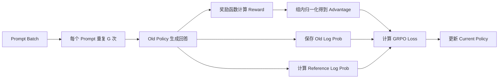
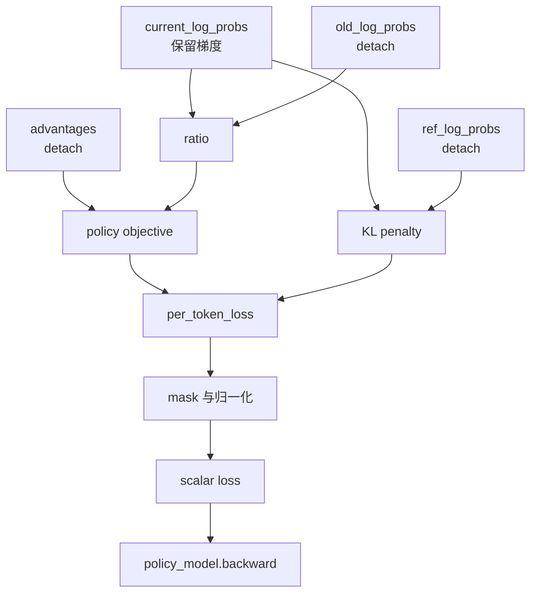

<figure class="source-cover">
  
  <figcaption>Imagen 生成配图，基于本文主题绘制。</figcaption>
</figure>

# GRPO PyTorch 伪代码详解

## 原始笔记元数据

```yaml
title: GRPO PyTorch 伪代码详解
aliases:
  - GRPO 实现详解
  - Group Relative Policy Optimization
tags:
  - LLM
  - RL
  - RLHF
  - GRPO
  - PyTorch
created: 2026-06-15
```

# GRPO PyTorch 伪代码详解

> **abstract** 本文目标
> 通过接近可运行的 PyTorch 伪代码，理解 GRPO 的关键实现细节，包括：
>
> - GRPO loss 如何构建
> - 哪些 Tensor 必须 `detach`
> - PPO-style ratio 与 clipping 如何工作
> - KL penalty 如何计算
> - 输入、输出及中间 Tensor 的形状变化

## 1. GRPO 整体流程

GRPO，即 Group Relative Policy Optimization，会为每个 prompt 生成一组回答，并使用组内相对奖励计算 advantage。



对于 prompt $q$，使用旧策略 $\pi_{\theta_{\text{old}}}$ 采样一组回答：

$$
\{o_1, o_2, \ldots, o_G\}
$$

每个回答得到一个 sequence-level 奖励：

$$
r_i = R(q, o_i)
$$

组内归一化 advantage：

$$
A_i =
\frac{r_i - \operatorname{mean}(r_1,\ldots,r_G)}
{\operatorname{std}(r_1,\ldots,r_G) + \epsilon}
$$

GRPO 通常为回答中的所有 token 使用同一个 sequence-level advantage：

$$
A_{i,t} = A_i
$$

## 2. GRPO Loss

### 2.1 Importance Sampling Ratio

每个 completion token 的 importance sampling ratio：

$$
\rho_{i,t}(\theta)
=
\frac{\pi_\theta(o_{i,t}\mid q,o_{i,<t})}
{\pi_{\theta_{\text{old}}}(o_{i,t}\mid q,o_{i,<t})}
$$

使用 log probability 计算：

$$
\rho_{i,t}(\theta)
=
\exp\left(
\log \pi_\theta(o_{i,t})
-
\log \pi_{\theta_{\text{old}}}(o_{i,t})
\right)
$$

### 2.2 PPO-style Clipped Objective

$$
L^{\text{policy}}_{i,t}
=
-\min\left(
\rho_{i,t}A_i,\;
\operatorname{clip}(\rho_{i,t},1-\epsilon,1+\epsilon)A_i
\right)
$$

### 2.3 Reference Model KL Penalty

使用非负 sampled KL estimator：

$$
D_{KL}
\approx
\exp(x)-x-1
$$

其中：

$$
x =
\log \pi_{\text{ref}}(o_{i,t})
-
\log \pi_\theta(o_{i,t})
$$

最终每个 token 的 loss：

$$
L_{i,t}
=
L^{\text{policy}}_{i,t}
+
\beta D_{KL}
$$

> **important**
> 训练时只对 completion token 计算 loss。Prompt token 和 padding token 必须被 mask 掉。

## 3. Tensor 形状约定

| 符号 | 含义 |
|---|---|
| `P` | 每个 batch 中不同 prompt 的数量 |
| `G` | 每个 prompt 生成的回答数量 |
| `N = P * G` | 总回答数量 |
| `S` | prompt 与 completion 的总长度 |
| `T` | completion 最大长度 |
| `V` | vocabulary size |

| Tensor | 形状 |
|---|---|
| `prompt_input_ids` | `[P, prompt_length]` |
| `completion_ids` | `[N, T]` |
| `full_input_ids` | `[N, S]` |
| `completion_mask` | `[N, T]` |
| `rewards` | `[N]` |
| `grouped_rewards` | `[P, G]` |
| `advantages` | `[N]` |
| `logits` | `[N, S, V]` |
| `current_log_probs` | `[N, T]` |
| `old_log_probs` | `[N, T]` |
| `reference_log_probs` | `[N, T]` |
| `ratio` | `[N, T]` |
| `per_token_kl` | `[N, T]` |
| `per_token_loss` | `[N, T]` |
| `loss` | scalar |

## 4. 提取 Completion Token Log Probability

```python
import torch
import torch.nn.functional as F


def gather_completion_log_probs(
    model,
    full_input_ids,       # [N, S]
    attention_mask,       # [N, S]
    completion_ids,       # [N, T]
):
    """
    返回模型对实际 completion token 的 log probability。

    输出:
        selected_log_probs: [N, T]

    注意:
        当前训练策略的输出必须保留计算图。
        old policy 和 reference model 应在 torch.no_grad() 中调用。
    """

    outputs = model(
        input_ids=full_input_ids,
        attention_mask=attention_mask,
    )

    logits = outputs.logits
    # logits: [N, S, V]

    # 自回归模型中，第 s 个位置的 logits 用于预测第 s+1 个 token。
    completion_logits = select_logits_predicting_completion(logits)
    # completion_logits: [N, T, V]

    log_probs_all_vocab = F.log_softmax(
        completion_logits.float(),
        dim=-1,
    )
    # [N, T, V]

    selected_log_probs = torch.gather(
        log_probs_all_vocab,
        dim=-1,
        index=completion_ids.unsqueeze(-1),  # [N, T, 1]
    ).squeeze(-1)

    # selected_log_probs: [N, T]
    return selected_log_probs
```

## 5. Rollout 与 Advantage 构建

```python
def generate_grpo_batch(
    policy_model,
    reference_model,
    prompts,
    reward_function,
    num_generations,
    tokenizer,
):
    """
    对每个 prompt 生成 G 个回答，并计算固定的 old/ref log probability。
    整个 rollout 阶段不需要梯度。
    """

    P = len(prompts)
    G = num_generations
    N = P * G

    # 每个 prompt 连续重复 G 次。
    repeated_prompts = repeat_each_prompt(prompts, repeats=G)

    # 使用 rollout/old policy 生成回答。
    with torch.no_grad():
        generated = policy_model.generate(
            repeated_prompts,
            do_sample=True,
            temperature=1.0,
            max_new_tokens=512,
        )

    full_input_ids = generated.full_input_ids       # [N, S]
    completion_ids = generated.completion_ids       # [N, T]
    attention_mask = generated.attention_mask       # [N, S]
    completion_mask = generated.completion_mask     # [N, T]

    # 保存 rollout 时 old policy 的 log probability。
    with torch.no_grad():
        old_log_probs = gather_completion_log_probs(
            model=policy_model,
            full_input_ids=full_input_ids,
            attention_mask=attention_mask,
            completion_ids=completion_ids,
        )

    # 必须固定，之后不能随 policy 更新。
    old_log_probs = old_log_probs.detach()

    # 计算固定 reference model 的 log probability。
    with torch.no_grad():
        reference_log_probs = gather_completion_log_probs(
            model=reference_model,
            full_input_ids=full_input_ids,
            attention_mask=attention_mask,
            completion_ids=completion_ids,
        )

    reference_log_probs = reference_log_probs.detach()

    # 奖励函数通常不可导，不应保留计算图。
    with torch.no_grad():
        decoded_answers = tokenizer.batch_decode(completion_ids)
        rewards = reward_function(
            prompts=repeated_prompts,
            answers=decoded_answers,
        )

    rewards = torch.as_tensor(
        rewards,
        dtype=torch.float32,
        device=completion_ids.device,
    ).detach()
    # rewards: [N]

    # 按 prompt 分组。
    grouped_rewards = rewards.view(P, G)
    # grouped_rewards: [P, G]

    group_mean = grouped_rewards.mean(dim=1, keepdim=True)
    # group_mean: [P, 1]

    group_std = grouped_rewards.std(
        dim=1,
        keepdim=True,
        unbiased=False,
    )
    # group_std: [P, 1]

    grouped_advantages = (
        grouped_rewards - group_mean
    ) / (group_std + 1e-4)
    # grouped_advantages: [P, G]

    advantages = grouped_advantages.reshape(N).detach()
    # advantages: [N]

    return {
        "full_input_ids": full_input_ids,
        "attention_mask": attention_mask,
        "completion_ids": completion_ids,
        "completion_mask": completion_mask.float(),
        "old_log_probs": old_log_probs,
        "reference_log_probs": reference_log_probs,
        "rewards": rewards,
        "advantages": advantages,
    }
```

## 6. GRPO Loss 完整实现

```python
def compute_grpo_loss(
    policy_model,
    batch,
    clip_epsilon=0.2,
    kl_beta=0.04,
):
    """
    输入:
        policy_model:
            当前正在训练的策略 pi_theta。

        batch:
            rollout 阶段生成的固定数据。

    输出:
        loss:
            scalar，可以直接调用 backward()。

        metrics:
            用于监控训练状态。
    """

    full_input_ids = batch["full_input_ids"]          # [N, S]
    attention_mask = batch["attention_mask"]          # [N, S]
    completion_ids = batch["completion_ids"]          # [N, T]
    completion_mask = batch["completion_mask"]        # [N, T]

    old_log_probs = batch["old_log_probs"]            # [N, T], detached
    ref_log_probs = batch["reference_log_probs"]      # [N, T], detached
    advantages = batch["advantages"]                  # [N], detached

    # 当前策略重新计算 token log probability。
    current_log_probs = gather_completion_log_probs(
        model=policy_model,
        full_input_ids=full_input_ids,
        attention_mask=attention_mask,
        completion_ids=completion_ids,
    )
    # current_log_probs: [N, T]
    # requires_grad=True
    #
    # 策略梯度与 KL 梯度都通过该 Tensor 回传。
    # 绝对不能 detach。

    # Importance sampling ratio。
    log_ratio = current_log_probs - old_log_probs
    ratio = torch.exp(log_ratio)
    # ratio: [N, T]

    # 将 sequence-level advantage 广播至每个 completion token。
    token_advantages = advantages.unsqueeze(1)
    # [N, 1]，计算时广播为 [N, T]

    unclipped_objective = ratio * token_advantages

    clipped_ratio = torch.clamp(
        ratio,
        min=1.0 - clip_epsilon,
        max=1.0 + clip_epsilon,
    )

    clipped_objective = clipped_ratio * token_advantages

    policy_objective = torch.minimum(
        unclipped_objective,
        clipped_objective,
    )

    # 梯度下降等价于最大化 policy objective。
    policy_loss_per_token = -policy_objective
    # [N, T]

    # 非负 sampled KL estimator。
    log_ref_current_ratio = ref_log_probs - current_log_probs

    per_token_kl = (
        torch.exp(log_ref_current_ratio)
        - log_ref_current_ratio
        - 1.0
    )
    # per_token_kl: [N, T]
    #
    # ref_log_probs 必须 detach。
    # current_log_probs 不能 detach，因为 KL 需要约束当前策略。

    per_token_loss = (
        policy_loss_per_token
        + kl_beta * per_token_kl
    )
    # per_token_loss: [N, T]

    # Mask 掉 padding token。
    masked_loss = per_token_loss * completion_mask

    # 先对每条回答的有效 token 求平均，再对 batch 求平均。
    token_count_per_sequence = (
        completion_mask.sum(dim=1).clamp_min(1.0)
    )
    # [N]

    sequence_loss = (
        masked_loss.sum(dim=1)
        / token_count_per_sequence
    )
    # [N]

    loss = sequence_loss.mean()
    # scalar

    # 日志指标不需要计算图。
    with torch.no_grad():
        valid_token_count = completion_mask.sum().clamp_min(1.0)

        mean_kl = (
            (per_token_kl * completion_mask).sum()
            / valid_token_count
        )

        clip_fraction = (
            ((ratio - 1.0).abs() > clip_epsilon).float()
            * completion_mask
        ).sum() / valid_token_count

        mean_ratio = (
            (ratio * completion_mask).sum()
            / valid_token_count
        )

    metrics = {
        "loss": loss.detach(),
        "mean_kl": mean_kl.detach(),
        "clip_fraction": clip_fraction.detach(),
        "mean_ratio": mean_ratio.detach(),
        "mean_reward": batch["rewards"].mean(),
    }

    return loss, metrics
```

## 7. 完整训练循环

```python
optimizer = torch.optim.AdamW(
    policy_model.parameters(),
    lr=1e-6,
)

for prompts in dataloader:

    # 阶段一：Rollout
    #
    # 生成出的 token、reward、old log probs 和 advantage 均被固定。
    batch = generate_grpo_batch(
        policy_model=policy_model,
        reference_model=reference_model,
        prompts=prompts,
        reward_function=reward_function,
        num_generations=8,
        tokenizer=tokenizer,
    )

    # 阶段二：使用同一批 rollout 做一次或多次策略更新。
    for update_index in range(num_policy_updates):
        optimizer.zero_grad()

        loss, metrics = compute_grpo_loss(
            policy_model=policy_model,
            batch=batch,
            clip_epsilon=0.2,
            kl_beta=0.04,
        )

        loss.backward()

        torch.nn.utils.clip_grad_norm_(
            policy_model.parameters(),
            max_norm=1.0,
        )

        optimizer.step()

    # 完成更新后丢弃当前 batch。
    # 下一轮使用更新后的 policy 重新生成回答。
```

## 8. 哪些 Tensor 必须 `detach`

| Tensor | 是否 `detach` | 原因 |
|---|---:|---|
| `current_log_probs` | 否 | 策略梯度和 KL 梯度需要经过它 |
| `old_log_probs` | 是 | 表示固定的 rollout policy |
| `reference_log_probs` | 是 | reference model 不参与训练 |
| `rewards` | 是 | 奖励是外部学习信号 |
| `advantages` | 是 | advantage 应被视为固定权重 |
| `completion_ids` | 天然无梯度 | 离散采样结果 |
| `completion_mask` | 天然无梯度 | 只用于过滤 padding |
| `ratio` | 否 | 策略梯度通过 ratio 回传 |
| `per_token_kl` | 否 | KL 必须约束当前策略 |

最关键的写法：

```python
ratio = torch.exp(
    current_log_probs - old_log_probs.detach()
)
```

错误写法：

```python
# 错误：current_log_probs 被 detach 后，策略目标不再产生梯度。
ratio = torch.exp(
    current_log_probs.detach() - old_log_probs.detach()
)
```

> **warning** 核心原则
> 所有作为固定训练信号或 baseline 的 Tensor 都应 detach。只有与当前策略输出相关的路径需要保留梯度。

## 9. `exp(x - x.detach())` 技巧

一些简化实现会写：

```python
ratio = torch.exp(
    current_log_probs - current_log_probs.detach()
)
```

它的前向值永远为：

$$
\exp(x-x)=1
$$

但仍保留梯度：

$$
\frac{\partial \exp(x-\operatorname{detach}(x))}
{\partial x}
=1
$$

因此，它本质上是一个“前向值为 1，但保留 policy-gradient 梯度”的技巧：

```python
surrogate = (
    torch.exp(
        current_log_probs
        - current_log_probs.detach()
    )
    * advantages.unsqueeze(1)
)
```

适用场景：

- 每批 rollout 只更新一次
- 完全 on-policy 的简化实现
- 不需要 PPO clipping

不适用场景：

- 对同一批 rollout 做多次更新
- 需要有效 PPO clipping
- 需要准确衡量 current policy 与 old policy 的偏移

> **note**
> 如果没有单独保存 `old_log_probs`，ratio 的前向值会始终为 1，PPO clipping 基本失去意义。

## 10. Tensor 数值变化示例

假设一个 prompt 生成四个回答：

```python
rewards = tensor([1.0, 0.0, 0.5, 1.0])
# shape: [G=4]
```

组内均值：

```python
mean = 0.625
```

组内标准差约为：

```python
std = 0.4146
```

归一化后的 advantages：

```python
advantages = tensor([
     0.904,
    -1.507,
    -0.301,
     0.904,
])
```

假设第一个回答有三个有效 token：

```python
old_log_probs = tensor([
    -1.20,
    -0.80,
    -0.50,
])

current_log_probs = tensor([
    -1.10,
    -0.90,
    -0.45,
])
```

计算 log ratio：

```python
log_ratio = current_log_probs - old_log_probs

# tensor([
#      0.10,
#     -0.10,
#      0.05,
# ])
```

计算 ratio：

```python
ratio = torch.exp(log_ratio)

# tensor([
#     1.105,
#     0.905,
#     1.051,
# ])
```

由于第一个回答的 advantage 为正，训练倾向于增加其 token 的概率。对于 advantage 为负的回答，训练倾向于降低其 token 的概率。

## 11. 梯度流向



梯度最终只应更新当前 `policy_model`：

```text
loss
 ├── policy objective
 │    └── current_log_probs
 │         └── policy_model parameters
 │
 └── KL penalty
      └── current_log_probs
           └── policy_model parameters
```

以下路径不应存在梯度：

```text
loss -X-> old policy
loss -X-> reference model
loss -X-> reward function
loss -X-> advantage normalization
```

## 12. 常见问题

### 12.1 同组奖励完全相同

<figure class="qa-figure">
  
  <figcaption>GRPO 常见问题：同组奖励完全相同</figcaption>
</figure>


```python
rewards = [1.0, 1.0, 1.0, 1.0]
advantages = [0.0, 0.0, 0.0, 0.0]
```

此时没有策略梯度，只剩 KL 梯度。

### 12.2 忘记 Completion Mask

<figure class="qa-figure">
  
  <figcaption>GRPO 常见问题：忘记 Completion Mask</figcaption>
</figure>


如果忘记 mask，模型会在 padding token 上计算 loss，产生错误梯度。

### 12.3 对 Current Log Probability 使用 `no_grad`

<figure class="qa-figure">
  
  <figcaption>GRPO 常见问题：Current Log Probability 需要梯度</figcaption>
</figure>


这会直接切断策略梯度：

```python
# 错误示例
with torch.no_grad():
    current_log_probs = gather_completion_log_probs(...)
```

### 12.4 没有固定 Old Policy

<figure class="qa-figure">
  
  <figcaption>GRPO 常见问题：固定 Old Policy</figcaption>
</figure>


如果每次计算 loss 时都使用当前 policy 重新计算 `old_log_probs`，ratio 会始终接近 1，PPO clipping 失效。

### 12.5 第一步 Loss 接近零

<figure class="qa-figure">
  
  <figcaption>GRPO 常见问题：第一步 Loss 接近零</figcaption>
</figure>


组内 advantage 的均值通常接近零，因此第一次更新时 scalar policy loss 可能接近零。

这不代表梯度为零。不同回答具有不同 advantage，它们仍会产生不同方向的参数梯度。

### 12.6 回答长度归一化

<figure class="qa-figure">
  
  <figcaption>GRPO 常见问题：回答长度归一化</figcaption>
</figure>


经典 GRPO 通常先对每条回答的 token loss 求平均，再对 batch 求平均。

不同归一化方式会改变长回答和短回答对最终梯度的贡献。DAPO、Dr.GRPO 等变体对该问题进行了进一步修改。

## 13. 实现检查清单

- [ ] 每个 prompt 生成了 `G > 1` 个回答
- [ ] `old_log_probs` 在 rollout 后固定并 detach
- [ ] `reference_log_probs` 不参与反向传播
- [ ] `advantages` 按 prompt 分组计算
- [ ] `advantages` 已 detach
- [ ] `current_log_probs` 保留计算图
- [ ] loss 只在 completion token 上计算
- [ ] padding token 已通过 `completion_mask` 排除
- [ ] 多次 policy 更新时始终复用同一份 `old_log_probs`
- [ ] 监控 `mean_kl`、`clip_fraction` 与 `mean_ratio`

## 14. 参考资料

- [DeepSeekMath：GRPO 原始论文](https://arxiv.org/abs/2402.03300)
- [Hugging Face TRL：GRPOTrainer](https://github.com/huggingface/trl/blob/main/trl/trainer/grpo_trainer.py)
- [Hugging Face LLM Course：GRPO](https://huggingface.co/learn/llm-course/en/chapter12/4)

