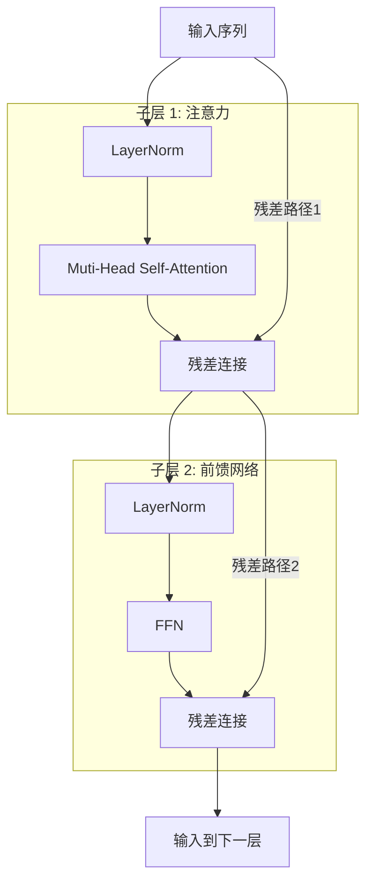
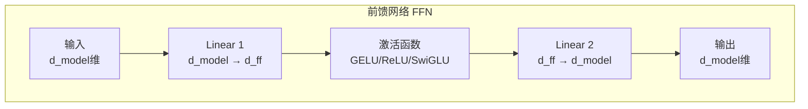
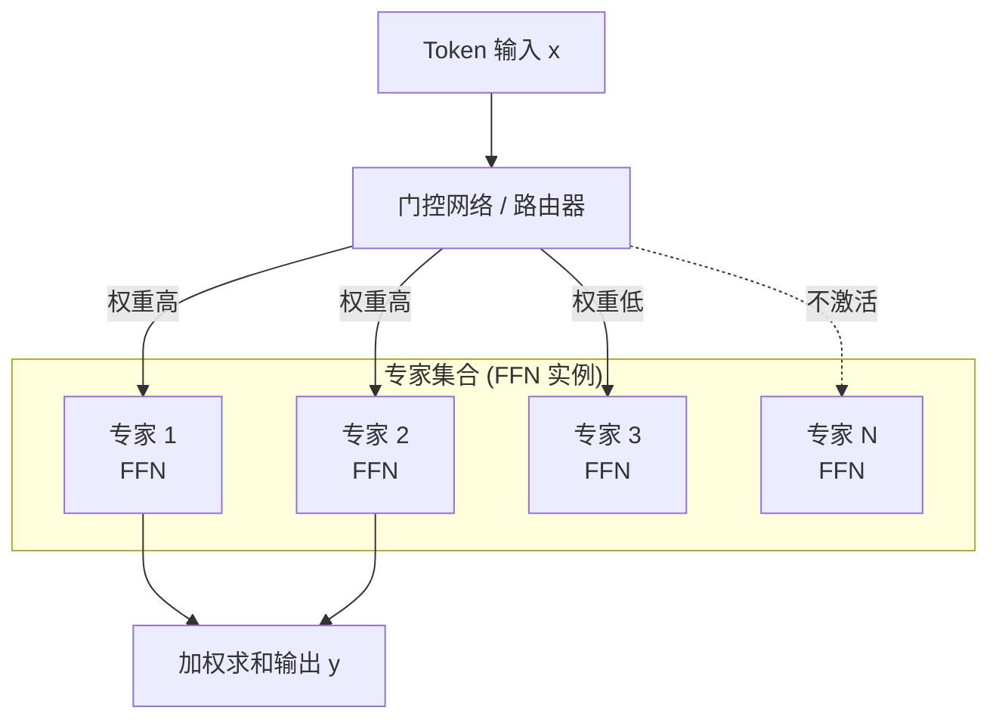

<figure class="source-cover">
  
  <figcaption>Imagen 生成配图，基于本文主题绘制。</figcaption>
</figure>

# 🧱 Transformer 层的核心组件

一个标准的Transformer层主要由两部分构成：**多头自注意力（Multi-Head Self-Attention）** 和 **前馈网络（Feed-Forward Network, FFN）**。为了让模型更稳定、训练更高效，还搭配了两个“胶水”组件：**残差连接（Residual Connection）** 和 **层归一化（Layer Normalization, LayerNorm）**[](https://bbs.huaweicloud.com/blogs/476445)。

一个编码器层（Decoder层结构类似，但多了一个带掩码的Attention子层）的内部数据流如下



1. **多头注意力 (Multi-Head Attention)**
    
    - **核心机制**：它让序列中的每个Token都能“环顾四周”，根据重要性加权整合所有Token的信息，从而理解上下文。其计算公式为$Attention(Q,K,V) = softmax(QK^T / √d_k) V$ [](https://cloud.tencent.cn/developer/article/2587262?policyId=1003)[](https://developer.baidu.com/article/detail.html?id=6899639)。
        
    - **多头机制**：通过多个“头”从不同角度并行捕捉语义关联，例如有的头可能专注词性，有的则聚焦语义[](https://developer.baidu.com/article/detail.html?id=6899639)。其公式为 $MultiHead(Q,K,V) = Concat(head_1,..., head_h)W^O$。
        
2. **前馈网络 (FFN)**  
    这是一个独立应用于每个Token的全连接网络，负责对Attention提取到的信息进行非线性变换和“思考”，通常包含两层线性变换和一个激活函数（如ReLU或GELU），且中间层维度通常远大于输入输出维度[](https://developer.aliyun.com/article/1652620)。
    
3. **残差连接 (Residual Connection)**  
    将子层的输入`x`直接加到其输出`Sublayer(x)`上，即输出为`x + Sublayer(x)`[](https://developer.aliyun.com/article/1652620)。这会形成一个“梯度高速公路”，有效缓解深层网络中的梯度消失问题，让训练成百上千层的巨型模型成为可能[](https://developer.aliyun.com/article/1652620)[](https://cloud.baidu.com/article/3323623)。
    
4. **层归一化 (Layer Normalization)**  
    对单个样本的所有特征进行归一化，使其均值为0，方差为1，保证数据分布稳定，加速模型收敛[](https://developer.aliyun.com/article/1652620)。
    
5. **(可选) 位置编码 (Positional Encoding)**  
    由于Transformer本身没有“顺序”的概念，需要额外注入位置信息。经典方案是用不同频率的正余弦函数[](https://cloud.tencent.cn/developer/article/2587262?policyId=1003)[](https://developer.aliyun.com/article/1518921)，而现在更流行**旋转位置编码 (Rope)**，它在计算Attention时，通过旋转矩阵巧妙地将相对位置信息融入内积中[](https://developer.baidu.com/article/detail.html?id=6899005)。


# 💻 代码实现示例

下面是一个用PyTorch实现单个`TransformerBlock`的简化示例，展示了如何集成以上所有组件。

```python
import torch
import torch.nn as nn

class TransformerBlock(nn.Module):
    def __init__(self, d_model: int, nhead: int, dim_feedforward: int = 2048, dropout: float = 0.1):
        super().__init__()
        # 1. 多头自注意力层
        self.self_attn = nn.MultiheadAttention(d_model, nhead, dropout=dropout, batch_first=True)
        # 2. 前馈网络 (FFN)
        self.linear1 = nn.Linear(d_model, dim_feedforward)
        self.dropout = nn.Dropout(dropout)
        self.linear2 = nn.Linear(dim_feedforward, d_model)
        
        # 3. 层归一化 (LayerNorm)
        # pre-LN架构：在残差连接之前进行归一化，训练更稳定
        self.norm1 = nn.LayerNorm(d_model)
        self.norm2 = nn.LayerNorm(d_model)
        
        # 4. dropout层 (用于残差连接之后)
        self.dropout1 = nn.Dropout(dropout)
        self.dropout2 = nn.Dropout(dropout)
        
        # 激活函数
        self.activation = nn.GELU() # 常用GELU

    def forward(self, src, src_mask=None):
        # 子层 1: 多头自注意力 + 残差连接 + 预归一化 (Pre-LN)
        # 1. 对输入进行归一化
        src_norm = self.norm1(src)
        # 2. 通过注意力层
        attn_output, _ = self.self_attn(src_norm, src_norm, src_norm, attn_mask=src_mask)
        # 3. 应用残差连接
        src = src + self.dropout1(attn_output)

        # 子层 2: 前馈网络 + 残差连接 + 预归一化
        # 1. 对前一个Attention子层的输出进行归一化
        src_norm = self.norm2(src)
        # 2. 通过FFN
        ffn_output = self.linear2(self.dropout(self.activation(self.linear1(src_norm))))
        # 3. 应用残差连接
        src = src + self.dropout2(ffn_output)
        
        return src
```


## FFN

简单来说，FFN中的两个线性层，分工非常明确：**第一层负责“扩展”与“激活”，第二层负责“压缩”与“整合”**。它们共同组成了一个**瓶颈结构**，极大地增强了模型的表达能力。

我们用一张图来理解它内部的“膨胀-收缩”过程：


下面详细拆解每一步的定位。

### 📈 第一层 Linear1：升维与非线性激活

- **定位**：**“特征探测器”与“模式提取器”**。
    
- **核心作用**：
    
    1. **大幅扩展维度**：它将输入的 `d_model` 维（例如768、4096）映射到一个高得多的**中间维度 `d_ff`**（通常是 `d_model` 的4倍，如3072、11008）。这个“膨胀”操作为模型提供了巨大的“思考空间”。
        
    2. **引入非线性**：紧接着的**激活函数**（如ReLU、GELU、SwiGLU）是关键。如果没有它，两个线性层叠加等价于一个线性层，FFN就失去了意义。激活函数让模型能够学习到数据中复杂的非线性模式。可以说，第一层+激活函数负责**从神经元中“激活”出丰富的特征响应**。
        
- **类比理解**：就像一个专家小组，每个人（每个中间维度神经元）被训练去识别某类特定模式（例如“否定语气”、“因果关系”、“数学运算”等）。高维空间让模型能并行训练成千上万个这样的“模式探测器”。
    

### 📉 第二层 Linear2：降维与特征整合

- **定位**：**“信息融合器”与“特征选择器”**。
    
- **核心作用**：
    
    1. **压缩维度**：将高维的、激活后的特征 `d_ff` **投影回原始的 `d_model` 维度**，使输出能与残差连接匹配，供下一层处理。
        
    2. **加权整合**：它学习了如何将第一层激活的众多模式，通过**线性组合**的方式，选择性地“融合”成当前Token更精炼、更有用的表示。这个投影过程本质上是在做**特征选择和信息提炼**，丢弃不那么重要的激活响应。
        
- **类比理解**：它就像一个“总编”。多位专家（第一层的神经元）各自提交了关于输入文本的分析报告（激活后的值），而“总编”（第二层）决定如何将这些报告**汇总成一份简洁、高质量的总结**（输出），同时根据重要性给不同专家的意见赋予不同权重。
    

### 🧠 为什么这个“膨胀-收缩”结构如此重要？

1. **更强的表达能力**：`d_model` 维是每个Token最终的表示空间，但直接在这个小空间里做非线性变换能力有限。通过临时“借用”一个更大的空间（`d_ff` 维），模型能学习到远比单层线性层更复杂、更精细的函数。
    
2. **参数效率**：虽然看起来参数量大了（两个线性层共 `2 * d_model * d_ff`），但它是一种**经济实惠**的增加表达能力的方式。相比于增加 `d_model` 或层数，调整 `d_ff` 能更灵活地控制计算量和效果之间的平衡。
    
3. **符合“注意力+处理”的模块化思想**：Transformer层的一个常见解读是：**注意力机制负责“交流”（在Token间聚合信息），而FFN负责“思考”（独立地对每个Token进行特征变换）**。FFN内部的“膨胀-收缩”结构，就是为了让这个“思考”过程更加强大。
    

### 🌰 举个直观的例子

假设输入是一个词“苹果”的向量（`d_model=4` 维，假设各维度粗略表示“水果味”、“科技感”、“红色”、“圆形”）。

1. **Linear1 升维**：`d_ff=16`。经过线性变换和GELU激活，16个中间神经元中有几个被强烈激活。比如：
    
    - 神经元7 激活很高 → 捕捉到某特定模式（如“可食用”）。
        
    - 神经元12 激活很高 → 捕捉到模式（如“知名品牌”）。
        
    - 神经元3 激活很低 → 不匹配（如“是一种动物”）。
        
2. **Linear2 降维**：将这16个激活值通过第二个线性层映射回4维。这个映射矩阵学会了结合：当“可食用”和“知名品牌”同时出现时，就在输出向量的“文化影响力”维度上加强，同时抑制无关的嘈杂激活。
    

最终，输出向量变成了“苹果”这个词经过深度思考后的更完善表示，可能包含了“水果”、“科技公司”等多义性信息，供上层使用。

### 💎 总结

|组件|定位|核心操作|目的|
|---|---|---|---|
|**Linear1 + 激活函数**|特征探测器、模式提取器|升维 (dmodel→dffdmodel​→dff​) + 非线性|在更大的空间中挖掘复杂特征，激活多样化的模式。|
|**Linear2**|信息融合器、特征选择器|降维 (dff→dmodeldff​→dmodel​)|融合所有探测到的模式，提炼出最精炼的信息供后续层使用。|

所以，两个Linear层缺一不可，它们共同构成了FFN的核心引擎，让每个Token都能在“静默”中完成一次复杂的内在思考。这也是为什么现代大模型在尝试改进FFN时（例如使用MoE、SwiGLU等），也始终保留着这个“膨胀-收缩”骨架的原因。

## MOE

刚才聊到的 FFN 结构，在大规模参数下会面临一个核心矛盾：**想提升模型能力，就需要更多的参数；但参数越多，计算成本也越高**。

**专家混合（MoE, Mixture-of-Experts）**正是为解决这个矛盾而生。它的核心思想是：**把原本一个巨大的 FFN，拆分成多个更小、更专业的 FFN（称为“专家”），然后每次只让少数几个专家工作**。

我们用一张图来快速理解 MoE 层的结构：



下面拆解 MoE 如何一步步“改良”标准的 FFN。

### 🔁 从“一个全才”到“多个专才”


|           | 标准 FFN                     | MoE 层                       |
| --------- | -------------------------- | --------------------------- |
| **参数形态**  | 一个大的、全能的网络                 | 多个并行的、较小的网络（专家）             |
| **计算方式**  | 每个 Token 都要经过**整个** FFN 计算 | 每个 Token 只经过**选中的少数几个**专家   |
| **参数利用率** | 所有参数对所有 Token 都激活          | 参数稀疏激活，每个 Token 只能“看到”一部分专家 |
| **目标**    | 学习一个通用的映射函数                | 学习多个专门的映射函数，并由门控自动选择        |
|           |                            |                             |


### 🧠 MoE 的核心组件

1. **多个专家 (Experts)**：每个专家本质上就是一个标准 FFN，拥有自己的两个线性层和激活函数。它们的结构相同，但参数不同，因此会擅长处理不同类型的 Token（例如，有的专长于动词处理，有的专长于数字推理）。
    
2. **门控网络 (Gating Network / Router)**：这是一个可学习的线性层（通常加一个 softmax 或 top-k 选择），它的输入是当前 Token 的表示 `x`，输出是一个概率分布，表示 `x` 应该被送往每个专家的“合适度”得分。
    

### ⚙️ MoE 的工作流程（以Top-2选专家为例）

1. **计算路由分数**：门控网络为每个专家计算一个分数 `g_i = Softmax(W_g · x)_i`。
    
2. **筛选 Top-K 专家**：通常只保留 `k` 个分数最高的专家（例如 `k=2`），其余专家的输出权重置为 0。这就是**稀疏激活**的关键。
    
3. **加权计算输出**：最终输出是这 `k` 个专家输出的加权和：`y = Σᵢ (g_i * Expert_i(x))`。
    

### 🚀 MoE 对 FFN 的核心改进

#### 1. 极大提升模型容量（参数总量），而计算成本基本不变

- **标准 7B 模型**：可能 7B 参数全部激活，推理需要 7B 的算力。
    
- **MoE 模型**：例如 **Mixtral 8x7B**，总参数量 47B，但推理时每个 Token 只激活 2 个专家（加上共享注意力层），实际使用的参数仅为 ~13B。**这就好比你有 8 位专家，每次只请 2 位来开会，既储备了丰富的知识（总容量大），又保持了较低的会务成本（计算量可控）。**
    

#### 2. 让模型自然地对知识进行“专业分工”

- 标准的 FFN 被迫学习所有类型的知识，参数之间容易产生干扰。
    
- MoE 的门控网络会隐式地学会把“相似”的 Token 分配给同一个专家，让不同专家专注于处理不同模式的数据。比如：
    
    - 专家 A 擅长数学推理 Token
        
    - 专家 B 擅长情感色彩 Token
        
    - 专家 C 擅长代码语法 Token
        
- **这种内生的专业化，往往比单个大 FFN 学到了更清晰的结构化知识。**
    

#### 3. 为超大模型（100B+）提供了可行的训练和推理路径

- 如果没有 MoE，1000B 参数的模型（如 Google 的 Switch-C）在训练和推理时计算成本会高到不可行。
    
- MoE 让**训练极大规模模型在工程上成为可能**，目前所有顶尖的超大规模模型（GPT-4、DeepSeek-V3、Grok-1 等）都采用 MoE 架构。
    

### ⚠️ MoE 带来的新挑战（以及改进方向）

MoE 不是银弹，它引入了新的工程难题，研究者也给出了应对方案：

|挑战|解释|改进方案|
|---|---|---|
|**训练不稳定**|门控网络很难学，某些专家可能被“饿死”（很少被选中）或“累死”（总被选中）。|**负载均衡损失**：在损失函数中加入一项，鼓励每个专家被选中的次数大致相等。|
|**推理内存占用大**|所有专家的参数都必须加载到显存中（即使只激活一小部分）。|**模型并行 + 专家卸载**，或使用更细粒度的 **DeepSeekMoE**（拆分专家为更小的细粒度单位，再动态组合）。|
|**通信开销高**|跨设备调度 Token 到不同专家会产生大量 All-to-All 通信。|优化并行策略（如 Expert Parallelism），设计硬件友好的路由模式。|
|**质量退化风险**|稀疏性可能导致模型学到“捷径”而非真正的知识分工。|引入 **共享专家**（如 DeepSeekMoE），让一部分永远激活的专家负责通用知识，其余负责专用知识。|

### 💎 总结：MoE 是如何改进 FFN 的？

> **MoE 把 FFN 从“一个全知全能的巨大网络”变成了“一组分工协作的小型网络，并由一个智能调度员按需分配任务”。**

- **结构上**：用 `n` 个并行的 FFN（专家） + 一个门控网络，替换原来的 1 个 FFN。
    
- **计算上**：从“全参数激活”变为“稀疏激活”（通常 `k=2` 个专家），实现 **参数量与计算量的解耦**。
    
- **能力上**：通过自动专业化分工，使模型总容量大幅提升，同时保持计算成本可控，是迈向 _**真正超大规模模型**_ 的关键一步。

# 🚀 近期大模型的创新变体

|变体|核心原理|关键特点 / 优势|
|---|---|---|
|**MHA (Multi-Head Attention)**|原始设计，多个注意力头并行计算[](https://developer.baidu.com/article/detail.html?id=6899639)。|奠基之作，效果好，但计算和内存成本高。|
|**MQA (Multi-Query Attention)**|所有头共享**同一对** `K` 和 `V` 矩阵[](https://developer.baidu.com/article/detail.html?id=6899639)。|推理时KV Cache极小，速度极快，但可能影响精度。|
|**GQA (Grouped-Query Attention)**|将查询头分组，每组共享一个 `K`、`V` 对，是MHA和MQA的折中方案[](https://developer.baidu.com/article/detail.html?id=6899005)。|平衡了推理速度与生成质量，Llama 2/3等模型采用。|
|**滑动窗口 (Sliding Window)**|每个Token只与固定大小的局部窗口内的Token计算注意力[](https://developer.baidu.com/article/detail.html?id=6899005)。|复杂度降至`O(n)`，能处理极长序列，但可能丢失长距离依赖。|
|**稀疏注意力 (Sparse Attention)**|通过固定模式（如间隔、块状）稀疏化注意力矩阵[](https://developer.baidu.com/article/detail.html?id=6899005)[](https://developer.baidu.com/article/detail.html?id=6899639)。|显著降低计算量，是处理超长文本的有效手段之一。|
|**混合注意力 (Hybrid Attention)**|将Transformer层与Mamba等**状态空间模型**层交替使用[](https://www.36kr.com/p/3770765015991049)。|兼具Transformer的高召回率和SSM的线性复杂度。|

