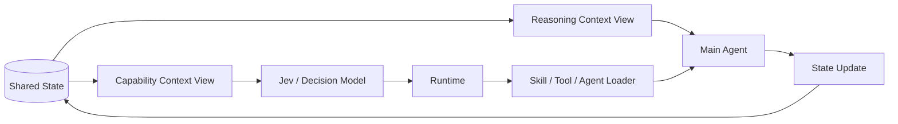
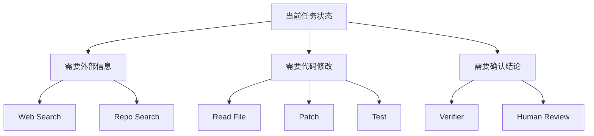
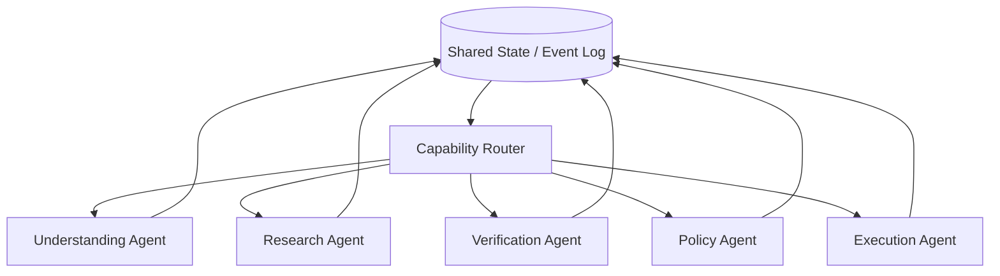
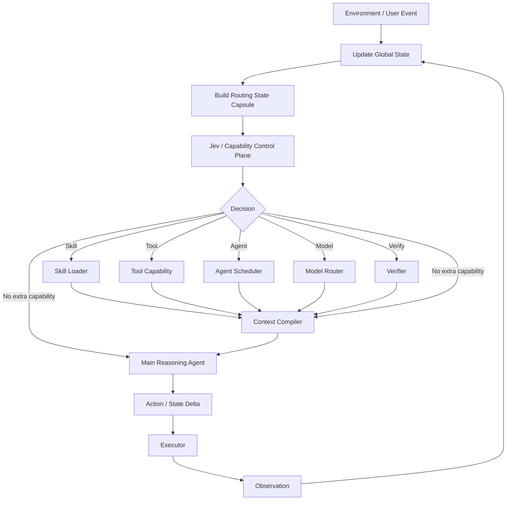

> **核心观点**
>
> 我现在越来越觉得，Agent 的下一阶段不应该只是继续往一个主模型的上下文里塞更多 Skill、Tool、Memory 和 Agent 描述，而应该开始认真设计 **Agent Runtime（Agent 运行时）**。
>
> 今天很多 Agent 看起来已经具备 Skill、Tool Calling、Memory、Multi-Agent、Context Compression 等能力，但它们往往仍然共享同一个基本结构：
>
> **主 Agent 一边理解问题，一边还要负责管理“自己拥有哪些能力、什么时候该调用、该调用哪一个”。**
>
> 这会带来两个越来越明显的问题：
>
> 1. **主上下文越来越脏**：Skill Meta、Tool Schema、Agent Description、Memory、历史 Observation 持续争夺 Attention；
> 2. **能力发现越来越贵**：即使采用 Progressive Disclosure（渐进式披露），主 Agent 为了“发现需要某个 Skill → 加载 Skill → 继续推理”，往往仍需要新增一次携带历史上下文的模型调用。
>
> 所以我更倾向于把 Agent Runtime 拆成两条相互协作、但上下文彼此隔离的流：
>
> - **Reasoning Stream（推理流）**：主 Agent 只负责理解、推理、规划、证据整合和输出；
> - **Capability Stream（能力流）**：由 Jev 这一类快速、结构化的决策模型负责 Skill / Tool / Model / Agent 的选择。
>
> 两条流共享底层 State（状态），但不共享完整 Context。主 Agent 不需要长期知道系统拥有的全部能力，Runtime 只在当前状态真正需要时，才把对应能力逐级编译、披露并注入。
>
> 这篇“器”真正想讨论的不是“怎么再给 Agent 增加一个 Tool Router”，而是一个更底层的问题：
>
> > **“选择做什么”和“真正把事情做好”，为什么一定要由同一个模型完成？**
>
> 如果这两个职责可以拆开，那么 Skill、Tool、Memory、Verifier、不同模型以及其他 Agent，就不再是主 Agent 永久携带的“附件”，而可以变成由 Runtime 根据状态动态授予的能力。
>
> 我认为，这会把 Agent 从“越来越臃肿的万能 Prompt”，推进到真正意义上的 **Runtime-driven Agent（运行时驱动 Agent）**。
>
> 用一句话概括这篇文章：
>
> > **过去是 Agent 携带能力；未来更可能是 Runtime 按状态赋予能力。**

---

## 1. 我所说的“器”，本质上是 Agent Runtime

### 1.1 “器”不是工具集合，而是运行机制

过去提到 Agent 的“器”，很容易想到：

```text
Browser
Search
Python
MCP
Database
Computer Use
```

这些当然重要，但它们更接近“可被调用的工具”。

我现在更关心的是比 Tool 再高一层的问题：

```text
什么状态应该进入什么上下文？
什么时候应该加载哪个 Skill？
哪个模型负责哪类判断？
什么时候需要另一个 Agent？
什么信息应该长期保存？
什么信息只在当前 Turn 出现？
Agent 之间怎样共享状态而不是反复转述？
什么结果可以直接执行？
什么结果必须验证？
什么时候应该回退？
什么时候应该停止？
```

所以我更愿意把“器”定义为：

> **把模型、上下文、Memory、Skill、Tool、Agent、验证器和环境组织起来，使整个认知与执行过程能够稳定运行的系统。**

它对应的核心组件不是某一个 Prompt，而是一组 Runtime Primitive（运行时原语）：

```text
State Store
Context Compiler
Capability Router
Skill Loader
Memory Retriever
Tool Executor
Agent Scheduler
Verifier
Event Bus
Trace / Observability
```

### 1.2 从“给 Agent 更多能力”转向“让 Runtime 决定何时给能力”

传统 Agent 越做越强，通常采用加法：

```text
更多 Tool
+ 更多 Skill
+ 更多 Memory
+ 更多 Agent
+ 更长 System Prompt
```

但如果这些能力最终都需要以某种形式进入主 Agent 的 Context，那么系统越强，主 Agent 同时承担的认知负担也越大。

我更希望把这个关系反过来：

$$
Agent_t
=
Model
+
CompiledContext(State_t)
+
GrantedCapabilities(State_t)
$$

其中：

$$
GrantedCapabilities_t
=
Route(State_t,\ Registry_t)
$$

也就是说：

> Agent 在某个时刻拥有什么能力，不再由“初始化时加载了什么”决定，而由当前状态决定。

这也是后面双流 Runtime、Progressive Disclosure、Capability Compilation 和 Multi-Agent State Sharing 的共同基础。

---

## 2. 现有 Agent 的问题：推理与能力管理混在了一起

### 2.1 Single Agent 和 Multi-Agent 本质上都有同一个问题

今天很多 Single Agent 的工作方式大致是：

```text
用户请求
   ↓
主 Agent
   ├── 理解任务
   ├── 回忆 Memory
   ├── 阅读 Skill 描述
   ├── 判断是否使用 Skill
   ├── 判断调用什么 Tool
   ├── 填 Tool 参数
   ├── 判断是否找另一个 Agent
   ├── 读取结果
   └── 继续推理
```

Multi-Agent 看起来拆开了：

```text
Supervisor
 ├── Research Agent
 ├── Coding Agent
 ├── Verification Agent
 └── Writing Agent
```

但很多时候只是把“一个 Agent 自己决定所有事情”，变成：

> **一个 Supervisor Agent 决定其他 Agent 做什么。**

它依然需要：

- 知道全部 Agent；
- 知道全部 Tool；
- 知道全部 Skill；
- 读取大量描述；
- 在自然语言推理中完成路由。

因此 Single / Multi Agent 虽然执行拓扑不同，但依然存在同一个结构问题：

> **Reasoning（推理）和 Capability Management（能力管理）混在同一个生成模型里。**

### 2.2 Skill 的 Progressive Disclosure 已经走对了一步

Anthropic 的 Agent Skills 已经采用了 Progressive Disclosure（渐进式披露）：

1. 启动时只把每个 Skill 的 `name` 和 `description` 放入系统上下文；
2. 模型判断相关后，再读取完整 `SKILL.md`；
3. 更大的 Skill 可以继续拆成额外文件，仅在需要时读取。

这比一次加载所有 Skill 已经节省很多上下文。

原本：

$$
C_{\text{all}}
=
\sum_{i=1}^{N} C_{\text{skill}_i}
$$

渐进式披露后：

$$
C_{\text{progressive}}
=
\sum_{i=1}^{N} C_{\text{meta}_i}
+
C_{\text{selected skill}}
$$

但这里还有一个可以继续追问的问题：

> **为什么所有 Skill 的 Meta 信息也必须由主 Agent 长期持有？**

如果 Skill 从几十个扩展到几百甚至几千个，Meta 本身仍然会成为持续存在的 Context Tax（上下文税）。

更重要的是，这些信息不只是消耗 Token，也会进入主模型的 Attention。

主 Agent 每一步都看到：

```text
PDF
GitHub
Calendar
Email
Search
Database
Coding
Spreadsheet
Browser
...
```

实际上等价于每一步都在提醒它：

> “你还有这些可能的行动。”

这会不断扩大主模型感知到的 Action Space（动作空间）。

因此，我认为 Progressive Disclosure 还可以再向前走一步：

> **不只是“Skill 内容按需加载”，而是“连 Skill 的存在本身都按需暴露给主 Agent”。**

### 2.3 渐进式披露还有一个隐藏成本：历史上下文会被重复输入


渐进式披露通常被理解成：

```text
先给 Skill Meta
→ 模型选择 Skill
→ 再加载完整 Skill
→ 继续推理
```

从“某一个时刻上下文里放了多少内容”来看，它确实比一次性加载全部 Skill 更省。

但如果从 **整个 Turn Loop 的累计推理成本** 来看，还存在另一层很容易被忽略的消耗：

> **为了完成“选择 Skill → 读取 Skill → 再继续推理”，往往需要新增一次模型请求，而这次请求并不是只发送新加载的 Skill，它通常还需要把前面的 Conversation、System Prompt、Memory、已有 Observation 等上下文再次作为前缀输入模型。**

例如第一次模型调用看到：

$$
X =
System + Conversation + Memory + SkillMeta
$$

模型判断：

```text
需要 Skill A
```

Runtime 随后读取 Skill A。第二次模型调用实际上更接近：

$$
X + Skill_A
$$

而不是只计算：

$$
Skill_A
$$

因此如果忽略 Prefix Cache（前缀缓存）等工程优化，两轮累计输入量近似为：

$$
C_{\text{two-turn}}
=
|X|
+
(|X| + |Skill_A|)
$$

即：

$$
C_{\text{two-turn}}
=
2|X| + |Skill_A|
$$

如果后续又因为 Tool Result、另一个 Skill、Verifier 等继续产生新的模型 Turn，那么累计成本会继续增长：

$$
C_{\text{total}}
=
\sum_{t=1}^{T}|Context_t|
$$

而不是简单等于最终一次上下文：

$$
|Context_T|
$$

这两个量非常不一样。

例如一个长任务里，主上下文已经有 $30K$ Token：

```text
第一次：
30K Context
→ 判断需要某个 Skill

第二次：
30K Context + 2K Skill
→ 调用 Skill 后继续推理

第三次：
32K Context + Tool Result
→ 再继续推理
```

即使 Skill 本身只有 2K Token，真正新增的系统计算并不只是这 2K，而是伴随着前面大段上下文被再次送入下一轮模型请求。

Prefix Caching 可以降低其中一部分重复前缀的实际计费与计算开销，但它并没有改变架构事实：

> **主 Agent 的每一次额外认知回合，都需要携带足够多的历史状态才能继续工作。**

所以我认为 Skill Progressive Disclosure 的问题不只是：

$$
N \cdot Skill
\rightarrow
N \cdot Meta + SelectedSkill
$$

还应该看到另一条轴：

$$
\text{Disclosure Step}
\rightarrow
\text{Additional Main-Model Turn}
\rightarrow
\text{Repeated Context Prefix}
$$

这恰恰进一步说明，Skill Discovery（能力发现）没有必要一定由主 Agent 自己完成。

在双流架构里，可以变成：

```text
Routing State Capsule
        ↓
      Jev
        ↓
直接决定 Skill A
        ↓
Runtime 在第一次 Main Agent 请求之前
就把必要的 Skill Fragment 编译进 Context
        ↓
Main Agent
```

于是原本：

```text
Main Agent Turn 1
→ 发现需要 Skill
→ Load Skill
→ Main Agent Turn 2
```

可以压缩成：

```text
Cheap Routing Pass
→ Load Skill
→ Main Agent Turn 1
```

主模型不必为了“发现自己需要什么能力”额外完成一次完整上下文推理。

如果记：

- $C_r$：Routing State 的输入成本；
- $C_m$：主 Agent 原始上下文成本；
- $C_s$：选中 Skill Fragment 的成本；

传统主 Agent 自路由近似为：

$$
C_{\text{self-route}}
\approx
C_m + (C_m + C_s)
=
2C_m + C_s
$$

而外置 Capability Router 可以接近：

$$
C_{\text{dual-stream}}
\approx
C_r + C_m + C_s
$$

由于理想情况下：

$$
C_r \ll C_m
$$

所以当主 Context 很长时，这个差距会越来越明显：

$$
C_{\text{self-route}} - C_{\text{dual-stream}}
\approx
C_m - C_r
$$

这也是我认为双流架构在长上下文 Agent 中尤其有价值的原因：

> **它节省的不只是 Skill 本身的 Token，而是尽可能避免为了 Capability Discovery 再跑一次昂贵的完整主上下文。**

### 2.4 真正的问题是 Context Pollution，而不仅是 Token

假设系统拥有 $N$ 个 Skill，每个 Skill 的 Meta 平均占用 $m$ 个 Token，那么传统渐进披露的常驻成本近似为：

$$
C_{\text{meta}} = N \cdot m
$$

但更难量化的是认知干扰：

$$
I_{\text{context}}
=
f(
\text{Irrelevant Instructions},
\text{Competing Actions},
\text{Conflicting Semantics}
)
$$

也就是说，即使 Context Window 足够大，也不能因此推出“什么都塞进去没有问题”。

上下文真正的问题包括：

- 无关能力持续占用 Attention；
- 不同 Skill 的说明之间可能发生指令干扰；
- 模型容易因为看到某个 Tool 而产生不必要调用；
- Tool 数量增加后，选择本身变成额外推理负担；
- 长任务中 Capability Meta 会和历史、Memory、Evidence 争夺上下文预算。

因此我的目标不只是：

> 少用一点 Token。

而是：

> **让主 Agent 的认知空间尽量只保留与当前任务真正相关的东西。**

---

## 3. 双流 Runtime：Reasoning Stream 与 Capability Stream

### 3.1 从“一个 Agent”变成“共享状态上的两条流”

我设想的结构不是简单增加一个 Router，而是把 Runtime 拆成两个不同的信息平面：



两条流分别承担：

### Reasoning Stream

主 Agent 负责：

- 理解任务；
- 建立世界模型；
- 提出假设；
- 规划；
- 消化证据；
- 整合结果；
- 生成最终输出。

### Capability Stream

Jev / Router 负责：

- 当前是否需要额外能力；
- 需要哪个 Skill；
- 需要哪个 Tool；
- 需要哪个 Agent；
- 是否应该升级更强模型；
- 是否进入 Verification；
- 是否应该请求人工；
- 是否已经满足 Stop 条件。

于是主 Agent 不再持续持有完整 Capability Registry（能力注册表）。

可以把两者写成：

$$
Context_t^{reason}
=
f_r(State_t)
$$

$$
Context_t^{capability}
=
f_c(State_t,\ Registry_t)
$$

其中：

$$
Context_t^{reason}
\neq
Context_t^{capability}
$$

这点很重要。

**双流不是简单用了两个模型，而是两个模型拥有两个不同的 Context View。**

### 3.2 Jev 更像 Control Plane，而不是一个 Tool

TypeSafe 在 2026 年 9 月发布的 Jev，把自己定义为 System One Model：输入非结构化状态，输出类型化、带概率的结构化决策，而不是开放式文本生成。

这类模型特别适合的问题不是：

> “请帮我完整解决这个问题。”

而是：

```text
当前应该选择哪个 Skill？
当前应该走哪个执行路径？
当前是否需要升级模型？
当前结果是否需要 Review？
当前应该继续、拆分还是停止？
```

这些问题具有一个共同特点：

> **输出空间是受限的。**

例如：

$$
A_t \in
\{
NoSkill,
Search,
GitHub,
Code,
Verifier,
HumanReview
\}
$$

这和主 LLM 的开放生成任务完全不同。

因此我不希望结构变成：

```text
Main Agent
   ↓
“我要不要调用 Router？”
   ↓
Jev
```

因为这样“是否路由”本身依然交给了主 Agent。

我更希望 Jev 是 Runtime 的一部分：

```text
Turn Boundary
     ↓
Runtime 自动构造 Routing State
     ↓
Jev
     ↓
Capability Decision
     ↓
Runtime 注入必要能力
     ↓
Main Agent
```

所以它更像：

> **Agent Runtime 的 Control Plane（控制平面）。**

而主 Agent 更像：

> **Reasoning / Data Plane（推理与任务处理平面）。**

### 3.3 Routing State Capsule：双流成立的关键

如果 Jev 每轮也读取完整 Conversation、完整 Memory、完整 Observation，那么系统虽然让主 Agent 变干净了，却只是把上下文成本复制到了另一个模型。

所以还需要一个中间结构：

> **Routing State Capsule（路由状态胶囊）**

例如：

```yaml
goal: 修复登录接口测试失败

phase: debugging

last_observation:
  endpoint: POST /login
  expected: 401
  actual: 200

active_artifacts:
  - auth.ts
  - auth.test.ts

completed_capabilities:
  - code_search

unresolved_need:
  - 定位认证逻辑为什么没有阻止未登录请求

risk:
  level: low

budget:
  remaining_steps: 4
```

Jev 不需要完整理解所有历史，而只需要知道：

> **当前状态下，下一个 Capability 应该是什么。**

因此完整系统里至少存在三种状态：

$$
State^{global}
$$

$$
Context^{reason}
=
Compile_{reason}(State^{global})
$$

$$
Context^{route}
=
Compile_{route}(State^{global})
$$

这让我觉得 **Context Compiler（上下文编译器）** 会成为未来 Agent Harness 的一个重要组件。

---

## 4. 从 Skill 渐进披露升级为 Capability Compilation


### 4.1 Skill 不应该只有“加载 / 不加载”两个状态

现在很多系统是：

```text
Meta
 ↓
Full Skill
```

但我觉得更合理的是多阶段披露：

```text
Level 0：主 Agent 完全不知道 Skill 存在
           ↓
Level 1：Runtime 选择 Skill
           ↓
Level 2：只披露 Skill Outline
           ↓
Level 3：检索当前相关 Section
           ↓
Level 4：只加载当前 Tool Schema / Instruction Fragment
           ↓
Main Agent 执行
```

例如一个 GitHub Skill 可能包含：

```text
GitHub
├── Repository
├── Search
├── Issue
├── Pull Request
├── Branch
├── Commit
├── Actions
└── Permission
```

如果当前任务只是：

> 找出最近关闭的几个 Issue。

主 Agent 没必要读取整个 GitHub Skill。

可以变成：

$$
Registry
\rightarrow
Skill
\rightarrow
Capability
\rightarrow
Instruction Fragment
$$

最终只加载：

```text
Issue Search
所需参数
返回结构
错误处理
```

这可以理解为：

> **Capability Compilation（能力编译）**

Runtime 根据当前 State，把庞大的能力库临时编译成当前 Turn 所需的一小段可执行上下文。

### 4.2 从“Skill Registry”到“Capability Graph”

进一步看，Skill 也未必应该是最终的调度单位。

因为真实任务里：

```text
Search Skill
GitHub Skill
Research Skill
Verification Skill
```

它们内部可能共享很多原子能力。

所以底层可以逐步演变成 Capability Graph：



Skill 只是对这些 Capability 的一种组织方式。

这样：

> **Skill 是人类维护知识的单位，Capability 是 Runtime 调度执行的单位。**

两者没必要完全等价。

### 4.3 Token 的“兑换”本质

这里我想把 Token 成本分成两类：

1. **Context Residency Cost（上下文驻留成本）**：有多少 Meta、Skill、Memory 长期放在主 Agent 上下文里；
2. **Repeated Turn Cost（重复回合成本）**：为了发现、加载、使用某个能力，需要额外触发多少次携带历史 Context 的主模型调用。

所以真正要优化的并不只是单轮 Prompt 长度，而是：

$$
C_{\text{lifetime}}
=
\sum_{t=1}^{T}
C_{\text{main},t}
+
\sum_{j=1}^{J}
C_{\text{router},j}
$$

理想状态不是机械地减少一次 Prompt，而是把本来需要高级主模型重复处理的路由工作，迁移到更小、更短、更结构化的 Routing Context 上。

传统做法：

$$
C_{\text{main}}
=
C_{\text{task}}
+
N \cdot C_{\text{meta}}
+
C_{\text{selected}}
$$

双流之后：

$$
C_{\text{main}}
=
C_{\text{reasoning}}
+
C_{\text{selected fragment}}
$$

而 Router 处理：

$$
C_{\text{route}}
=
C_{\text{state capsule}}
+
C_{\text{registry}}
$$

表面看信息并没有消失。

真正改变的是：

$$
\text{Expensive Reasoning Context}
\rightarrow
\text{Cheap Decision Context}
$$

也就是说：

> **我不是把信息凭空压缩掉，而是把“不值得占用高级推理上下文的信息”搬到更适合做结构化决策的系统里。**

这就是我说的“兑换”。

它带来的收益至少有四层：

1. **Token Cost**：主模型不再反复承担 Registry 成本；
2. **Latency**：受限决策可以交给更快模型；
3. **Context Purity**：主 Agent 看不到无关能力；
4. **Capability Scaling**：系统能力数量增长时，不要求主 Agent 的 Context 同比例增长。

### 4.4 Confidence Gate：Router 也不能成为新的单点真理

Jev 这类模型可以输出概率，但概率不意味着绝对正确。

所以我不希望系统逻辑是：

```text
Jev 说 GitHub
→ 一定 GitHub
```

更合理的是：

$$
Decision =
\begin{cases}
\text{Execute}, & p \ge \tau_h \\
\text{Review}, & \tau_l \le p < \tau_h \\
\text{Fallback}, & p < \tau_l
\end{cases}
$$

例如：

```text
高置信
→ Runtime 直接加载对应 Capability

中置信
→ 给小模型或主 Agent 做二次判断

低置信 / 多候选接近
→ 回退到完整 Agent 决策
```

这里的阈值不能拍脑袋决定，而应该基于历史 Trace 做校准。

这也意味着 Router 本身会逐渐形成新的训练数据：

```text
State
→ Router Decision
→ Actual Capability
→ Outcome
→ 是否成功
```

未来完全可以继续形成：

$$
Routing\ Trace
\rightarrow
Evaluation
\rightarrow
Router\ Optimization
$$

---

## 5. 从 Single Agent 走向 Multi-Agent：共享 State，而不是转述聊天


### 5.1 Multi-Agent 最大的问题之一其实是信息损失

我之前讨论 Teamwork 时越来越关注一个问题：

> 人和人协作时，信息会在“开会 → 转述 → 再对齐 → 再执行”的层级传播中不断丢失。

Multi-Agent 也有完全一样的问题。

如果结构是：

```text
Agent A
 ↓ 生成自然语言总结
Agent B
 ↓ 再总结
Agent C
```

那么：

$$
Information_{C}
\subseteq
Information_{B}
\subseteq
Information_{A}
$$

每次 Handoff（交接）都可能发生：

- 事实丢失；
- 不确定性丢失；
- 证据来源丢失；
- 失败尝试丢失；
- 原始 Artifact 丢失；
- “为什么这样判断”的边界信息丢失。

因此 Multi-Agent 的通信不应该主要依赖：

> “请把刚才发生的事情总结给下一个 Agent。”

更应该依赖：

> **共享 State + Typed Event + Artifact Reference。**

### 5.2 Agent 之间应该传“状态变化”，而不是重新讲故事

例如 Research Agent 完成一次搜索后，不只是输出：

```text
我查了一下，可能是 A。
```

而应该写入：

```yaml
event: evidence_added

hypothesis_id: H3

evidence:
  claim: A 与目标现象存在关联
  source: artifact://search/result/128
  confidence: medium
  provenance:
    agent: research_agent
    timestamp: ...

impact:
  supports:
    - H3
  contradicts:
    - H1
```

Verification Agent 读取的不是 Research Agent 的“总结”，而是：

- 原始证据；
- Evidence Unit；
- 对应 Hypothesis；
- Provenance；
- 当前 State。

这样我的 Layer 4 / 5 / 6 就可以直接落到“器”上：

```text
Layer 4  Hypothesis
       ↓ 写入 State

Layer 5  Verification Agent / Tool
       ↓ 写入 Evidence Event

Layer 6  Evidence Integration
       ↓ 更新 World State
```

于是“术”里的理论结构变成“器”里的数据结构和 Runtime 事件。

### 5.3 Event Bus：Agent 不必知道所有 Agent

Multi-Agent 还可以继续使用同样的 Control Plane 思想。

不是：

```text
Research Agent 知道 Coding Agent
Coding Agent 知道 Verification Agent
每个 Agent 知道所有其他 Agent
```

而是：

```text
Agent
  ↓
Event Bus / Shared State
  ↓
Capability Router
  ↓
选择下一个 Agent
```

结构变成：



这会带来一个非常重要的变化：

> **Agent 之间由“互相认识”变成“共享协议”。**

这样系统扩展一个新 Agent 时，不要求所有旧 Agent 都重新学习它是谁。

### 5.4 Memory、Gene、Policy Tree 都应该成为 Runtime Resource

之前我把：

- Memory；
- Gene；
- Policy Tree；
- Rule；
- Case；
- Boundary；

更多理解成 Agent 的知识。

现在我觉得到了“器”层，可以再往前抽象：

> **它们其实都是 Runtime Resource（运行时资源）。**

主 Agent 不应该天然持有它们。

应该由 Runtime 根据 State 决定：

```text
当前需要历史事实
→ Memory Retriever

当前需要类似判例
→ Gene Retriever

当前进入研判阶段
→ Policy Tree

当前存在冲突规则
→ Defeasible Reasoner

当前需要外部证据
→ Verification Capability
```

因此 Semantic Harness 不只是 Prompt。

它可以被 Runtime 编译为：

$$
Semantic\ Constraint
\rightarrow
Context\ Constraint
+
Capability\ Constraint
+
Execution\ Constraint
$$

例如：

> “理解阶段不能直接输出研判结论”

不仅可以写成 Prompt：

```text
禁止研判
```

还可以在 Runtime 层实现：

```text
phase = understanding

available_capabilities:
  - content_understanding
  - evidence_retrieval

disabled_capabilities:
  - final_policy_decision
```

这就从“许愿”进一步变成：

> **通过能力空间本身约束模型能做什么。**

我认为这正是“术”真正进入“器”的地方。

---

## 6. 我理想中的 Agent Runtime

### 6.1 一个完整的 Turn Loop

最终我希望一次 Agent Turn 不再是：

```text
Prompt
→ LLM
→ Tool
→ LLM
```

而是：



可以写成：

$$
S_t
\xrightarrow{CompileRoute}
R_t
\xrightarrow{Router}
C_t
\xrightarrow{CompileReason}
X_t
\xrightarrow{MainAgent}
A_t
\xrightarrow{Environment}
O_{t+1}
\xrightarrow{Update}
S_{t+1}
$$

其中：

- $S_t$：全局状态；
- $R_t$：路由状态胶囊；
- $C_t$：当前选中的 Capability；
- $X_t$：给主 Agent 的最终 Reasoning Context；
- $A_t$：Agent 行动；
- $O_{t+1}$：环境反馈。

我觉得这个公式比传统：

$$
Prompt \rightarrow LLM \rightarrow Output
$$

更接近未来真正的 Agent Runtime。

### 6.2 “道—法—术—器”在这里形成闭环

把之前的概念全部放回来，可以看到它们其实是逐层收敛的。

| 层 | 我关心的问题 | 在 Runtime 中的落点 |
|---|---|---|
| 道 | Agent 到底是什么 | 持续演化的 State Machine，而不是一次模型调用 |
| 法 | 信息应该如何进入模型 | Context Engineering、按需披露、分层状态 |
| 术 | Agent 应该如何理解和判断 | Semantic Harness、Hypothesis、Verification、Gene、Policy Tree |
| 器 | 上面的东西怎样稳定运行 | State Store、Context Compiler、Router、Skill Loader、Agent Scheduler、Event Bus |

因此“器”的价值不是再发明一套新理论。

它更像是：

> **把前面的原则编译成一个真正执行得出来的系统。**

### 6.3 我认为“器”的核心不是 Tool，而是 Runtime

过去说 Agent 的“器”，很容易想到：

```text
Browser
Search
Python
MCP
Database
Computer Use
```

但这些更像“工具”。

我现在觉得真正意义上的“器”应该再高一层：

> **器不是 Agent 有哪些工具，而是 Agent 的能力、上下文、状态和模型如何被 Runtime 组织起来。**

未来一个成熟 Agent 系统的核心竞争力可能并不只是：

> “我接了多少 Tool。”

而是：

```text
什么状态应该进入什么上下文？
什么时候调用什么能力？
哪个模型负责哪类判断？
什么信息应该长期保存？
什么信息只应该在当前 Turn 出现？
Agent 之间如何共享事实而不反复转述？
什么结果可以直接执行？
什么结果必须验证？
什么时候应该回退？
什么时候应该停止？
```

这些才是“器”真正需要回答的问题。

### 6.4 最后的判断：从 Agent 携带能力，走向 Runtime 按需赋予能力

我觉得这一轮思考最值得留下的一句话是：

> **过去是 Agent 携带能力，未来更可能是 Runtime 按状态赋予能力。**

传统 Agent：

$$
Agent
=
Model
+
All\ Skills
+
All\ Tools
+
Memory
+
Prompt
$$

我更希望它逐渐变成：

$$
Agent_t
=
Model
+
CompiledContext(State_t)
+
GrantedCapabilities(State_t)
$$

其中能力不是永久拥有，而是动态授予：

$$
Capability_t
=
Route(State_t,\ Registry_t)
$$

这会让 Agent 从一个越来越臃肿的“万能 Prompt”，逐渐变成一个真正由 Runtime 驱动的认知系统。

Jev 对我真正的启发也正在这里。

它并不一定是最终答案，也不意味着所有 Routing 都应该交给 Jev。但它把一个过去经常被隐藏在 LLM Chain-of-Thought 里的问题显式化了：

> **“选择做什么”和“真正把事情做好”，为什么一定要由同一个模型完成？**

一旦把这两个问题拆开，很多原本只能依靠 Prompt 勉强维持的机制，都可以变成 Runtime 的正式组成部分：

```text
Context Compiler
Capability Router
Progressive Disclosure
Confidence Gate
State Store
Event Bus
Agent Scheduler
Verifier
Observability
```

最终，“器”并不是给 Agent 增加更多东西。

恰恰相反。

它是在努力让主 Agent **少背一点东西、少知道一点无关信息、少承担一点不属于它的职责**，再通过 Runtime 在恰当的时刻，把真正需要的能力送到它面前。

这可能才是 Context Engineering 继续往前走之后，真正自然的一步：

> **从“怎么把更多信息放进 Context”，走向“怎么让 Runtime 决定什么根本不应该进入 Context”。**

---

## 参考资料

1. TypeSafe AI. **Introducing System One Models & Jev**. 2026-09-15.<br>
   https://typesafe.ai/blog/introducing-system-one-models-and-jev

2. Anthropic. **Equipping agents for the real world with Agent Skills**. 2025-10-16.<br>
   https://www.anthropic.com/engineering/equipping-agents-for-the-real-world-with-agent-skills

3. Anthropic. **Introducing Agent Skills**. 2025-10-16.<br>
   https://www.anthropic.com/research/skills

4. Jev Agent. **Agent tool selection with Jev**.<br>
   https://jev-agent.com/use-cases/agent-tool-selection

5. GodsBoy. **jev-agent-skill-router**. 2026-09.<br>
   https://github.com/GodsBoy/jev-agent-skill-router<br>
   注：其中给出的 Skill Routing 实验规模较小，作者也明确标注为 exploratory result，更适合作为工程方向参考，而不是生产准确率结论。
